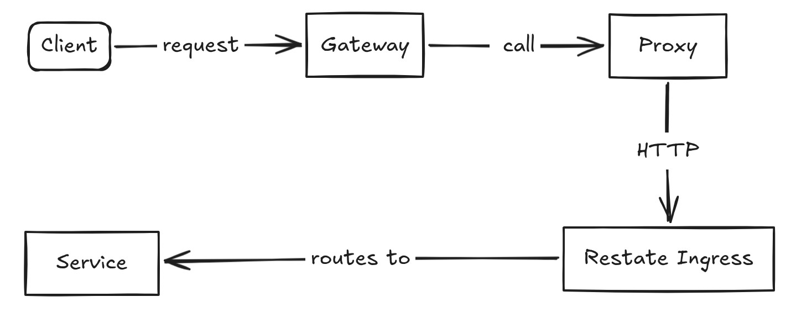
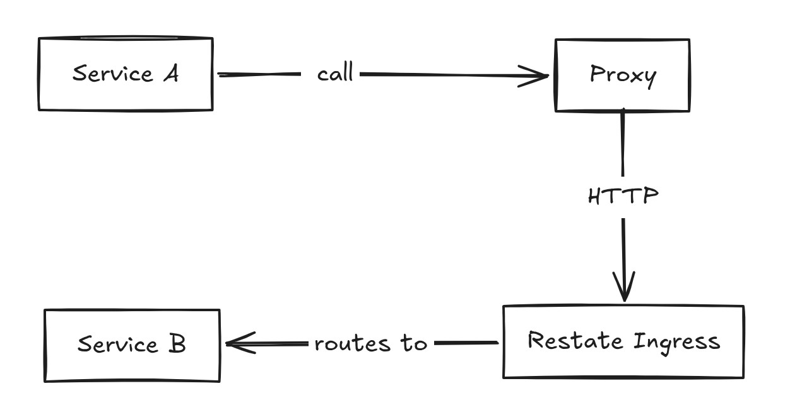

# ShopNexus Server

[](https://wakatime.com/badge/github/shopnexus/shopnexus-server)

A marketplace backend in Go — **microservices in a monorepo**, orchestrated by [Restate](https://restate.dev) durable execution.

> Development timeline: [timeline.md](assets/timeline.md)
>
> Code convention: [convention.md](assets/convention.md)

## Why?

### Why microservice in a monorepo?

*Many repos are hard to manage*.
> Imagine 100hr+ on configuring things on each repo :D

Splitting into many repos means configuring shared dependency versions across each project — staying in one repo sidesteps that. The microservice shape is still there (separate schemas, cross-module calls over the Restate ingress), so promoting a module to its own deployment later is a config change, not a refactor.

### Why Restate?

*Orchestration over choreography*.

The flow runs linearly top-to-bottom, which is easier to debug than tracing events across handlers. In practice it's the message queue between modules — failures retry indefinitely with backoff (no message dropped, no DLQ needed) — and the journal makes those retries durable.

## Request Flow

Every call goes through a **proxy interface** that mirrors each service's method signatures — callers invoke it as if it were the service itself, while the proxy forwards the request over HTTP to the Restate ingress, which then routes it to the target service.



Cross-service calls take the exact same path — Service A never calls Service B directly. Both external traffic and inter-service calls fan in through the proxy and the Restate ingress, so durability, retries, and observability apply uniformly to every call in the system.



For example, the order service depends on `Inventory` as an **interface**, so the call site reads like an ordinary in-process method call:

```go
// Service "order" calling to "inventory" through the proxy interface
inventories, err := orderbiz.inventory.ReserveInventory(ctx, inventorybiz.ReserveInventoryParams{
    OrderID: order.ID,
    Items:   items,
})
```

## Distributed Lock (Redis)

```go
unlock := b.locker.Lock(ctx, "order:123")
defer unlock()
```

Currently I only implement basic Redis lock/unlock, but while working on it I noticed a problem: if the handler takes too long, the lock TTL could expire mid-execution. To handle this, I added a background goroutine that extends the TTL every ttl/2, so long-running handlers never lose the lock. Calling unlock() stops the goroutine and DELs the key.

## Modules

Each module has its own README with ER diagrams, domain concepts, flows, and endpoints.

| Module                                       | Description                                                            |
| -------------------------------------------- | ---------------------------------------------------------------------- |
| [`account`](internal/module/account/)        | Auth, profiles, contacts, favorites, payment methods, notifications    |
| [`catalog`](internal/module/catalog/)        | Products, categories, tags, comments, hybrid search                    |
| [`order`](internal/module/order/)            | Cart, checkout, pending items, seller confirmation, payment, refunds   |
| [`inventory`](internal/module/inventory/)    | Stock management, serial tracking, audit history                       |
| [`promotion`](internal/module/promotion/)    | Discounts, ship discounts, scheduling, group-based price stacking      |
| [`analytic`](internal/module/analytic/)      | Interaction tracking, weighted product popularity scoring              |
| [`chat`](internal/module/chat/)              | Messaging, conversations, read receipts                                |
| [`common`](internal/module/common/)          | Resource/file management, object storage, service options, SSE         |

## Tools

- **[pgx/v5](https://github.com/jackc/pgx)** as the PostgreSQL driver, wrapped in `pgsqlc.Storage[T]` for connection pooling and transaction support.
- **[SQLC](https://sqlc.dev)** generates type-safe Go structs and query methods from SQL. Config in `sqlc.yaml`. Uses `guregu/null/v6` for nullable types.
- **pgtempl** (`cmd/pgtempl/`) generates SQLC query templates from migration files, producing CRUD queries automatically.
- **genrestate** (`cmd/genrestate/`) generates Restate service definitions and proxy interfaces from Go interface definitions.
- **migrate** (`cmd/migrate/`) manages database migrations. Migration files are in `<module>/db/migrations/` with the format `<version>_<description>.sql`.
