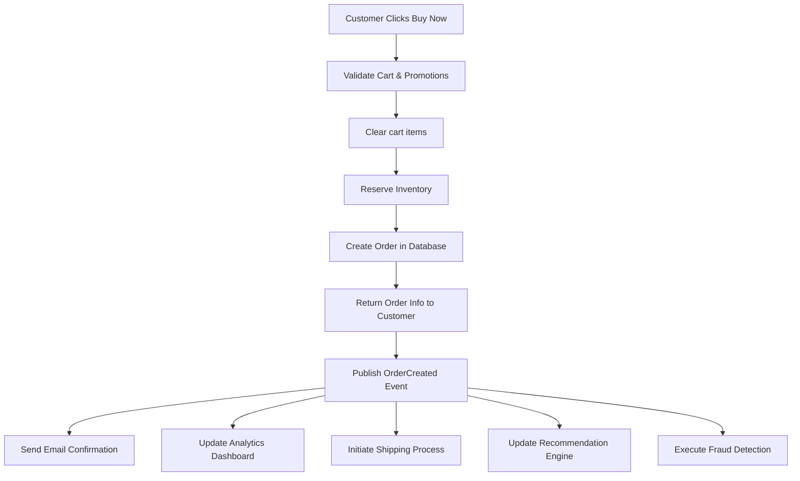

# ShopNexus Remastered

[](https://wakatime.com/badge/user/592c97c4-15ad-49cb-ac34-d607be35c524/project/79f8a24e-0fe8-417e-b42b-2009d7a4362f)

A production-grade e-commerce backend built in Go, designed as a **modular monolith** that can evolve into **microservices**. Supports multi-vendor marketplaces with real-time chat, AI-powered recommendations, event-driven architecture, and pluggable payment/shipment providers.

> Development timeline and engineering notes: [timeline.md](timeline.md)

---

## Architecture

```
cmd/
  migrate/          Database migration runner
  seed/             Data seeding utilities
  server/           Main application server

internal/
  app/              Application bootstrap & dependency injection (Uber fx)
  infras/           Infrastructure clients (PostgreSQL, Redis, Kafka, S3, PubSub)
  module/
    account/        User accounts, auth, profiles, favorites, payment methods
    catalog/        Products, categories, brands, tags, reviews, search
    order/          Cart, checkout, payments, shipments, refunds
    inventory/      Stock levels, serial tracking, audit history
    promotion/      Discounts, schedules, promotion rules
    analytic/       Interaction tracking, product popularity scoring
    chat/           Real-time messaging between customers and vendors
    common/         Resource management, file storage, service options
    system/         Outbox pattern for reliable event publishing
  shared/           Pagination, response helpers, storage interface, validation
```

### Dual Deployment Mode

- **Modular Monolith**: All modules in one process. Simple to develop, deploy, and debug.
- **Microservices**: Each module runs as its own process. Independent scaling and deployment.

### Key Patterns

- **Vertical Slice Architecture** — each module owns its own migration, queries, business logic, and HTTP transport
- **Choreography over Orchestration** — services communicate via Kafka events, no central coordinator
- **Outbox Pattern** — reliable event publishing with guaranteed delivery to Kafka
- **Table Per Type (TPT)** — database inheritance via foreign key relationships
- **Transaction Callbacks** — `WithTx()` with automatic commit/rollback, nested transaction support
- **Type-Safe SQL** — SQLC generates Go code from SQL queries, no ORM overhead
- **Dependency Injection** — Uber fx wires all modules with lifecycle management

---

## Tech Stack

| Layer | Technology |
|-------|-----------|
| Language | Go 1.26 |
| HTTP Framework | Echo v4 |
| Database | PostgreSQL 18 |
| Cache | Redis 8 |
| Message Queue | Kafka (via Watermill) |
| Object Storage | MinIO (S3-compatible) |
| Search | Hybrid vector + BM25 search (Qdrant-compatible) |
| DI Framework | Uber fx |
| SQL Generation | SQLC |
| Auth | JWT (access + refresh tokens) |
| Validation | validator/v10 with custom enum validators |
| Distributed Compute | Restate |
| Serialization | sonic (bytedance) |

---

## Modules

### Account

Handles user identity, authentication, and account-related data.

- **Authentication**: Register and login with email, phone, or username. JWT access tokens with refresh token rotation. Password hashing via bcrypt.
- **Profiles**: Name, gender, date of birth, avatar (linked to resource management), email/phone verification status. Supports Customer and Vendor account types.
- **Contacts**: Multiple shipping addresses per account. Each contact stores full name, phone, address, and address type (Home/Work). Auto-sets first contact as default.
- **Favorites**: Add/remove product SPUs to a wishlist. Paginated listing with duplicate prevention. Check if a product is favorited.
- **Payment Methods**: Store multiple payment methods (credit card, e-wallet, bank transfer, etc.) with flexible JSONB metadata. Set one as default per account. Partial unique index ensures single default.
- **Notifications**: Notification center with read/unread status, channel routing, and scheduled delivery.
- **Income History**: Vendor earnings tracking with balance snapshots per transaction.

**Endpoints**: `/api/v1/account/auth/*`, `/api/v1/account/me`, `/api/v1/account/contact/*`, `/api/v1/account/favorite/*`, `/api/v1/account/payment-method/*`

---

### Catalog

Product catalog with full-text search, vector-based recommendations, and review system.

- **Product SPU (Standard Product Unit)**: Base product entity with name, description, slug, category, brand, active status, and specifications (JSONB). Supports soft delete.
- **Product SKU (Stock Keeping Unit)**: Sellable variants under an SPU. Each SKU has its own price, attributes (JSONB), package details, stock level, and "can combine" flag for bundles.
- **Categories**: Hierarchical product categories with parent-child relationships. Search by name with pagination.
- **Brands**: Brand management with search and pagination.
- **Tags**: SEO tags linked to products via many-to-many relationship. Tag search and listing.
- **Comments & Reviews**: Score-based reviews (0-100 scale) on products. Supports nested comments (comment on comment). Upvote/downvote tracking. Detailed rating breakdowns (5-star distribution).
- **Search**: Hybrid search combining dense vector embeddings and sparse BM25 scoring. Configurable weight distribution between dense and sparse results. Background cron jobs sync product metadata and embeddings to the search service.
- **Recommendations**: Personalized product recommendations per user. Cache-backed with automatic invalidation on new interactions.

**Endpoints**: `/api/v1/catalog/product-spu/*`, `/api/v1/catalog/product-sku/*`, `/api/v1/catalog/product-detail`, `/api/v1/catalog/product-card/*`, `/api/v1/catalog/comment/*`, `/api/v1/catalog/tag/*`, `/api/v1/catalog/brand/*`, `/api/v1/catalog/category/*`

---

### Order

Complete order lifecycle from cart to delivery, with multi-vendor support.

- **Shopping Cart**: Add/remove SKUs to cart. Persistent per user with vendor grouping. Unique constraint prevents duplicate SKU entries.
- **Checkout**: Multi-vendor checkout in a single transaction. Supports "Buy Now" (instant purchase) and cart-based checkout. Apply promotion codes per item. Select payment and shipment options per order.
- **Orders**: Order creation with full audit trail. Tracks customer, vendor, payment, shipment, address, costs (product cost, product discount, ship cost, ship discount, total). Order statuses: Pending, Processing, Success, Canceled, Failed.
- **Order Items**: Line items per order with SKU snapshot (name, unit price, quantity). Serial number assignment for serialized products.
- **Payments**: Pluggable payment provider interface.
  - **VNPay**: QR code, bank transfer, ATM payments with IPN webhook verification.
  - **COD (Cash on Delivery)**: Simple payment on delivery.
  - Payment status tracking with expiration dates.
- **Shipments**: Pluggable shipment provider interface.
  - **GHTK**: Express, Standard, Economy tiers. Quote calculation, label generation, real-time tracking, ETA estimation.
  - Shipment statuses: Pending, LabelCreated, InTransit, OutForDelivery, Delivered, Failed, Cancelled.
- **Refunds**: Refund requests with pickup or drop-off methods. Status tracking through the full lifecycle. Proportional refund calculation for partially discounted orders.
- **Refund Disputes**: Dispute mechanism for contested refunds with status resolution.

**Endpoints**: `/api/v1/order/cart/*`, `/api/v1/order/checkout/*`, `/api/v1/order/*`, `/api/v1/order/refund/*`

---

### Inventory

Stock management with serial number tracking and audit trail.

- **Stock**: Track stock quantities per SKU or promotion. Serial-required flag for products needing individual serial tracking.
- **Serial Numbers**: Individual serial/IMEI tracking per unit. Statuses: Active, Inactive, Taken, Damaged. Uses `SELECT ... FOR UPDATE SKIP LOCKED` for race-free serial assignment.
- **Stock History**: Full audit trail of every stock change (additions, removals, adjustments) for tax and dispute purposes.

---

### Promotion

Flexible discount and promotion engine.

- **Promotions**: Create promotions with activation rules, date ranges, and vendor ownership. Types: Discount, ShipDiscount, Bundle, BuyXGetY, Cashback.
- **Discounts**: Configurable rules: minimum spend threshold, maximum discount cap, percentage-based or fixed amount discounts.
- **Promotion References**: Target specific products (SPU/SKU), categories, or brands.
- **Schedules**: Cron-based scheduling for time-limited promotions.
- **Price Calculation**: Integrated with the order module to compute final prices with stacked discounts.

---

### Analytics

Event-driven user behavior tracking and product popularity scoring.

- **Interaction Tracking**: Fire-and-forget tracking of user events (views, clicks, purchases, reviews, ratings, cart actions). Batch insert support for high throughput. Events published to Kafka for downstream consumers.
- **Product Popularity**: Weighted scoring model that updates in real-time via Kafka consumers. Configurable weights per event type:
  - Positive signals: purchase (0.8), add_to_favorites (0.6), add_to_cart (0.5), write_review (0.5), view (0.3)
  - Negative signals: report_product (-1.2), refund_requested (-0.7), cancel_order (-0.6), rating_low (-0.5)
- **Counters**: Per-product tracking of view count, purchase count, favorite count, cart count, and review count.
- **Top Products**: Query products sorted by popularity score with pagination.

**Endpoints**: `/api/v1/analytic/interaction`, `/api/v1/analytic/popularity/top`, `/api/v1/analytic/popularity/:spu_id`

---

### Chat

Real-time messaging between customers and vendors.

- **Conversations**: One conversation per customer-vendor pair (auto-deduplicated). Sorted by last message time. Participants can list all their conversations with pagination.
- **Messages**: Text, image, and system message types. Message status tracking: Sent, Delivered, Read. JSONB metadata for image URLs and system event data. Cursor-based message history.
- **WebSocket**: Real-time message delivery at `/ws/chat`. JWT-authenticated connections. Incoming message types: `send_message`, `mark_read`. Outgoing message types: `new_message`, `read_receipt`, `error`. Messages persisted to database and pushed to online recipients. Read receipts notify the other participant.
- **Read Receipts**: Batch mark-as-read for all unread messages in a conversation. Other participant notified via WebSocket.

**Endpoints**: `/api/v1/chat/conversation`, `/api/v1/chat/conversation/:id/messages`, `WS /ws/chat`

---

### Common

Shared services used across all modules.

- **Resource Management**: Attach files and images to any entity (products, profiles, refunds, comments). Reference-based association with flexible ref types. CRUD operations on resource references.
- **Object Storage**: Abstraction layer supporting local filesystem and S3-compatible storage (MinIO, AWS S3). Presigned URL generation with configurable TTL for secure access.
- **Service Options**: Dynamic registry for payment providers, shipment providers, and storage backends. Used by order module to discover available options at runtime.

---

### System

Internal infrastructure for reliability.

- **Outbox Events**: Implements the [Transactional Outbox Pattern](https://microservices.io/patterns/data/transactional-outbox.html). Events are written to a database table within the same transaction as business data, then published to Kafka asynchronously. Guarantees at-least-once delivery even if Kafka is temporarily unavailable.

---

## Infrastructure

```yaml
PostgreSQL 18     # Primary database (multi-schema, one schema per module)
Redis 8           # Caching, session storage, in-memory struct storage
Kafka (KRaft)     # Event streaming, async inter-module communication
MinIO             # S3-compatible object storage for files and images
Restate           # Distributed state management (3-node cluster)
```

---

## Development Conventions

### Database
- Table Per Type (TPT) for schema inheritance
- Audit snapshots for tax and transaction disputes
- `SELECT ... FOR UPDATE` for race condition prevention
- `SELECT ... FOR UPDATE SKIP LOCKED` for concurrent task picking (serial assignment)
- Default values only for commonly-missing fields (created_at, status, is_active)

### Go
- Vertical slice folder structure (by module)
- Defensive programming: validate at both transport and biz layers
- Always use `null.XXX` from guregu/null instead of pointers (better debugging, validator/v10 compatible)
- Use `db+EntityName` naming for storage entities from SQLC
- No global state: config injected via constructor, not via `GetConfig()`

### Events
- Choreography pattern: services react to events, no orchestrator
- Compensating transactions for failure recovery
- All inter-module communication via Kafka topics

---

## Getting Started

### Prerequisites

- Go 1.26+
- Docker & Docker Compose

### Run Infrastructure

```bash
docker compose -f deployment/docker-compose.yml up -d
```

### Run Migrations

```bash
go run ./cmd/migrate up
```

### Seed Data

```bash
go run ./cmd/seed
```

### Start Server

```bash
go run ./cmd/server
```

The server starts at `http://localhost:8080`. Health check: `GET /health`.

---

## Order Flow



---

## Notes

- Array params in requests: `/products?ids=1,2,3` parsed via custom Echo binder, filtered with `sqlc.slice` for batch queries
- Enum validation: `emit_enum_valid_method: true` in sqlc.yaml + `validateFn=Valid` struct tag integrates SQLC enums with validator/v10
- Interface nil comparison: comparing interface values with nil requires typed nil, not untyped nil ([details](https://stackoverflow.com/questions/29138591/hiding-nil-values-understanding-why-go-fails-here))
- `omitempty` only works for pointer, slice, map, interface types — not zero-value structs
- `omitnil` from validator/v10 does not work with untyped nil ([issue](https://github.com/go-playground/validator/issues/1209))
- pgx/v5 has implicit prepared statement support — no additional SQLC configuration needed

### Future Plans

- Use sqids instead of raw IDs for external-facing identifiers
- Implement [Anubis](https://github.com/TecharoHQ/anubis) to block AI crawlers
- Add Echo middlewares: rate limiter, request ID, etc.
- Cursor pagination with encoded filter conditions
- [x402](https://www.x402.org/) for crypto payments
- Redis Bloom filters for performance optimization
- Protobuf domain models to decouple from database schema
- Permission checking via Casbin
