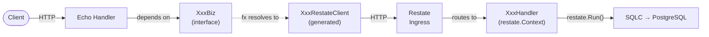
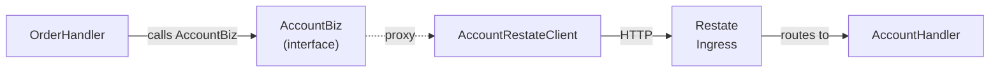

# ShopNexus Server

[](https://wakatime.com/badge/github/shopnexus/shopnexus-server)

A social marketplace backend in Go — **microservices in a monorepo**, orchestrated by [Restate](https://restate.dev) durable execution.

**No customer/vendor distinction** — any account can both buy and sell. Orders track `buyer_id` and `seller_id` per transaction.

> Development timeline: [timeline.md](timeline.md)

## Architecture

Entry point: `cmd/server/main.go` → `fx.New(app.Module).Run()`.

Eight vertical-slice modules, each owning their database schema, business logic, and HTTP transport. Modules communicate through Restate durable execution — every cross-module call is an HTTP request to the Restate ingress, giving exactly-once delivery and automatic retries. Each module can be deployed as a standalone service by pointing its Restate registration to a different host.

Dependency injection is handled by [Uber fx](https://github.com/uber-go/fx). Each module's `fx.go` provides both the concrete `*XxxHandler` (registered with Restate) and the `XxxBiz` interface (a generated Restate proxy used by other modules and transport handlers).

### Module Structure

Every module under `internal/module/<name>/` follows the same vertical-slice layout:

```text
biz/
  interface.go      # XxxBiz interface + XxxHandler struct + constructor + go:generate directive
  restate_gen.go    # Auto-generated Restate HTTP client (DO NOT EDIT)
  *.go              # Business logic methods (use restate.Context)
db/
  migrations/       # SQL schema (*.up.sql / *.down.sql)
  queries/          # SQLC query templates (pgtempl-generated + *_custom.sql for hand-written)
  sqlc/             # Generated DB code (DO NOT EDIT)
model/
  *.go              # DTOs, domain models, error sentinels
transport/echo/
  *.go              # HTTP handlers
fx.go               # Uber fx module wiring
```

### Request Flow



Cross-module calls follow the same path — when `OrderHandler` needs account data, it calls `AccountBiz` (interface), which fx resolves to `AccountRestateClient`, which goes through Restate ingress to `AccountHandler`:



## Restate Durable Execution

All business logic methods use `restate.Context` instead of `context.Context`. This is required for Restate's `Reflect()` registration and enables:

- **Durable side effects**: DB writes inside `restate.Run()` closures are journaled and replay-safe. If the process crashes mid-execution, Restate replays the journal and skips already-completed steps.
- **Cross-module RPC**: calls between modules go through auto-generated proxy clients (`XxxRestateClient`), which are HTTP calls to the Restate ingress. This makes every cross-module call durable and retryable.
- **Fire-and-forget**: `restate.ServiceSend(ctx, "ServiceName", "MethodName").Send(params)` for asynchronous work like notifications and analytics tracking — durable, exactly-once delivery.
- **Terminal errors**: client-facing errors (validation, not found, conflict) use `.Terminal()` to prevent Restate from retrying them.

### Integration Pattern

1. `interface.go` defines the `XxxBiz` interface, `XxxHandler` struct, `ServiceName()` method, and a `//go:generate` directive.
2. `restate_gen.go` is auto-generated by `cmd/genrestate/` — implements `XxxBiz` via HTTP calls to Restate ingress.
3. `fx.go` provides both `*XxxHandler` (for Restate registration) and `XxxBiz` (proxy, for cross-module deps and transport).
4. Transport handlers depend on `XxxBiz` (interface), never `*XxxHandler` (concrete).
5. `app/restate.go` registers all Handler structs with `restate.Reflect()` and auto-registers with the Restate admin API on startup.

## Database Design

Each module owns a PostgreSQL schema (`account.*`, `catalog.*`, `order.*`, etc.) — no cross-schema foreign keys. This enforces module boundaries at the database level and makes extraction straightforward.

The database layer uses three tools:

- **[pgx/v5](https://github.com/jackc/pgx)** as the PostgreSQL driver, wrapped in `pgsqlc.Storage[T]` for connection pooling and transaction support.
- **[SQLC](https://sqlc.dev)** generates type-safe Go structs and query methods from SQL. Config in `sqlc.yaml`. Uses `guregu/null/v6` for nullable types.
- **pgtempl** (`cmd/pgtempl/`) generates SQLC query templates from migration files, producing CRUD queries automatically. Custom queries go in `*_custom.sql` files (not overwritten by pgtempl).

### Nullable Types

- `guregu/null/v6` for DB fields in SQLC-generated structs.
- `*T` pointers for JSON serialization in models exposed to Restate — generic types like `null.Value[T]` break Restate's JSON schema generation.
- `ptrutil.PtrIf[T](val, valid)` for converting nullable DB types to pointers.

## Infrastructure

| Service    | Package                      | Purpose                                       |
| ---------- | ---------------------------- | --------------------------------------------- |
| PostgreSQL | `internal/shared/pgsqlc`     | Multi-schema DB with pgxpool                  |
| Redis      | `internal/infras/cache`      | Struct caching (Sonic JSON serialization)      |
| Redis      | `internal/infras/locker`     | Distributed RWMutex (SET NX + auto-renewal)   |
| NATS       | `internal/infras/pubsub`     | Message queue (JetStream)                     |
| Restate    | `internal/infras/restate`    | Durable execution HTTP ingress                |
| Milvus     | `internal/infras/milvus`     | Vector search for hybrid product search       |
| S3/Local   | `internal/infras/objectstore`| File storage with presigned URLs              |

### External Providers

Payment and transport are pluggable via a `map[string]Client` pattern. Each provider implements a `Client` interface and is registered at startup.

| Provider  | Package                        | Implementations                      |
| --------- | ------------------------------ | ------------------------------------ |
| Payment   | `internal/provider/payment`    | VNPay (QR/Bank/ATM), COD            |
| Transport | `internal/provider/transport`  | GHTK (Express/Standard/Economy)     |
| Geocoding | `internal/provider/geocoding`  | Nominatim (OpenStreetMap)            |
| LLM       | `internal/provider/llm`        | OpenAI, AWS Bedrock, Python backend |

### Distributed Locking

The `internal/infras/locker` package provides a distributed RWMutex backed by Redis, used to prevent TOCTOU race conditions on concurrent mutations of the same entity.

```go
// Exclusive lock — blocks other Lock and RLock callers on the same key
unlock := b.locker.Lock(ctx, "order:payment:123")
defer unlock()

// Shared lock — allows concurrent RLock, blocks Lock callers
unlock := b.locker.RLock(ctx, "order:seller-pending:abc")
defer unlock()
```

- **Auto-renewal**: a background goroutine extends the TTL every `ttl/2`, so long-running handlers never lose the lock. The `unlock()` func stops the goroutine and DELs the key.
- **TTL** is configured once via `locker.Config{TTL: 30 * time.Second}` at construction time, not per call.
- **When to use Lock**: write operations that race with other writes on the same entity (e.g., `ConfirmPayment` vs `CancelUnpaidCheckout` on the same payment).
- **When to use RLock**: read operations that need a consistent snapshot while a write may be in progress. Pure query endpoints (no side effects) generally don't need RLock — stale data from a concurrent write is acceptable and the caller can retry.
- **When NOT to lock**: inside `restate.Run()` closures. The lock must be acquired outside durable steps — if Restate replays the journal, the lock spin would replay from cache (no-op), leaving the handler running without actual lock protection.

#### Choosing a lock key

Lock by the **entity that owns the mutation**, not the entity being mutated. Three questions:

1. **Who causes the mutation?** Lock by the actor's scope — `sellerID`, `paymentID`, `refundID`. Not by individual rows being modified.
2. **Batch or single?** If the operation takes a batch of entities (e.g., seller confirms multiple items), the lock scope must contain all of them. Locking per-item in a batch risks deadlock when two requests lock items in different order.
3. **Would any request need multiple locks?** If yes, escalate to a coarser scope (e.g., items → seller) to eliminate circular-wait deadlocks. Only use fine-grained locks when coarse locking is a measured bottleneck.

```go
func handler() {
  unlock := b.locker.Lock(ctx, fmt.Sprintf("order:seller-pending:%s", params.Account.ID))
  defer unlock()
  // Logic
}
```

## Code Conventions

### Naming

| Thing                          | Pattern              | Example                  |
| ------------------------------ | -------------------- | ------------------------ |
| Interface (public API)         | `XxxBiz`             | `AccountBiz`             |
| Implementation                 | `XxxHandler`         | `AccountHandler`         |
| Generated Restate proxy        | `XxxRestateClient`   | `AccountRestateClient`   |
| Constructor                    | `NewXxxHandler`      | `NewAccountHandler`      |
| Import alias for shared model  | `sharedmodel`        | `internal/shared/model`  |

### Error Handling

- **Client-visible errors**: `sharedmodel.NewError(httpStatusCode, "message")` defined in each module's `model/error.go`. Always return with `.Terminal()` to prevent Restate retries.
- **Internal errors**: `fmt.Errorf("action: %w", err)` — no "failed to" prefix (e.g., `fmt.Errorf("get account: %w", err)`).
- **Wrapping terminal errors**: use `sharedmodel.WrapErr(msg, err)` instead of `fmt.Errorf` — it preserves the terminal flag through the error chain.

### Code Generation Pipeline

Three generators run in sequence:

1. **pgtempl** → generates SQLC query templates from migration SQL
2. **SQLC** → generates type-safe Go from those query templates
3. **genrestate** → generates Restate proxy clients from `XxxBiz` interfaces

## Modules

Each module has its own README with ER diagrams, domain concepts, flows, and endpoints.

| Module                                       | Description                                                            |
| -------------------------------------------- | ---------------------------------------------------------------------- |
| [`account`](internal/module/account/)        | Auth, profiles, contacts, favorites, payment methods, notifications    |
| [`catalog`](internal/module/catalog/)        | Products (SPU/SKU), categories, tags, comments, hybrid search          |
| [`order`](internal/module/order/)            | Cart, checkout, pending items, seller confirmation, payment, refunds   |
| [`inventory`](internal/module/inventory/)    | Stock management, serial tracking, audit history                       |
| [`promotion`](internal/module/promotion/)    | Discounts, ship discounts, scheduling, group-based price stacking      |
| [`analytic`](internal/module/analytic/)      | Interaction tracking, weighted product popularity scoring              |
| [`chat`](internal/module/chat/)              | REST messaging, conversations, read receipts                           |
| [`common`](internal/module/common/)          | Resource/file management, object storage, service options, SSE         |
