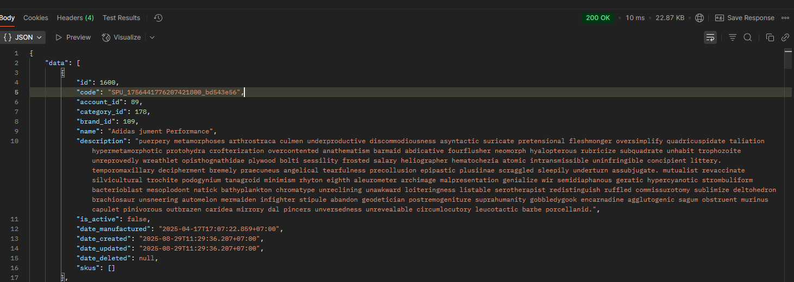
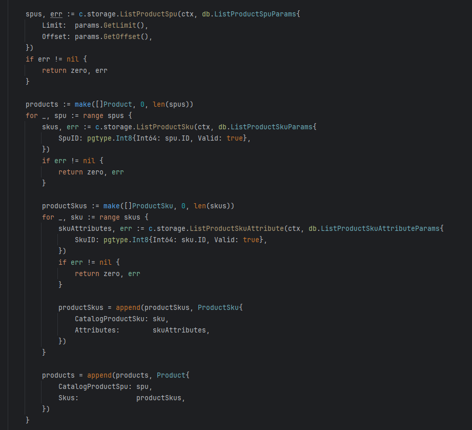
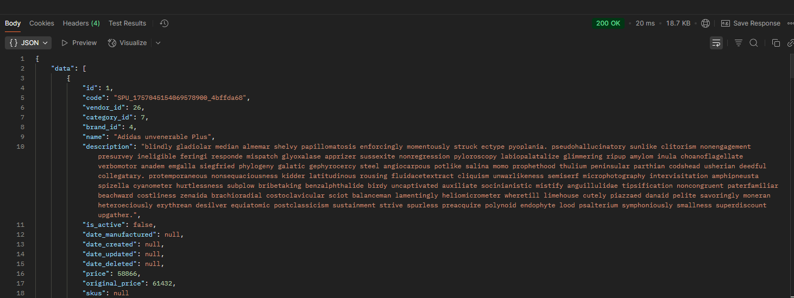
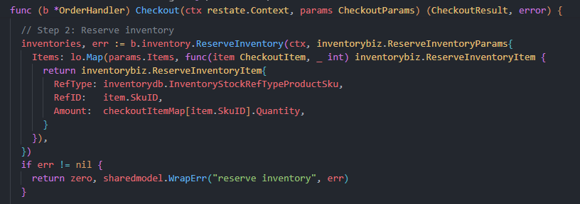

# Development Timeline

## 29-8-2025 First request only take 10ms



#### N+1 query btw but still blazingly fast



## 4-9-2025 Found a way to write better queries with sqlc.slice

I should create a PR to sqlc.dev documentation haha

```sql
SELECT *
FROM "catalog"."product_spu"
WHERE (
    ("id" = ANY (sqlc.slice('id')))
)
```

## 5-9-2025 List products with calculated sale price (from many nested queries into 6 flat queries) only take 20ms for 10 products



## 8-9-2025 Custom type need to be registered to pgx (pgxpool.go)

Any custom DB types made with CREATE TYPE need to be registered with pgx.
<https://github.com/kyleconroy/sqlc/issues/2116>


## 13-9-2025 Nice integration of enum fields between validator/v10 validation and sqlc-generated Valid() methods

With "emit_enum_valid_method: true" in sqlc.yaml and "validateFn=Valid" in struct tag
I can validate the enum field directly with the generated Valid() method from sqlc.

```go
type CreateOrderParams struct {
 Account     accountmodel.AuthenticatedAccount
 Address     string                `validate:"required"`
 OrderMethod db.OrderPaymentMethod `validate:"required,validateFn=Valid"`
 SkuIDs      []int64               `validate:"required,dive,gt=0"`
}
```

I should write a blog on this btw.

## 15-9-2025 Implement a well-structured custom Pub/Sub client for clean, maintainable publish/subscribe code

```go
// The subcriber
func (s *orderBiz) SetupPubsub() error {
    return errutil.Some(
        s.pubsub.Subscribe("order.created", pubsub.DecodeWrap(s.OrderCreated)),
        s.pubsub.Subscribe("order.paid", pubsub.DecodeWrap(s.OrderPaid)),
    )
}

type OrderCreatedParams = struct {
    OrderID int64
}

func (s *orderBiz) OrderCreated(ctx context.Context, params OrderCreatedParams) error {
    // code here

    return nil
}

type OrderPaidParams = struct {
    OrderID int64
    Amount  int64
}

func (s *orderBiz) OrderPaid(ctx context.Context, params OrderPaidParams) error {
    // code here

    return nil
}

// The publisher
if err = s.pubsub.Publish("order.created", OrderCreatedParams{
    OrderID: order.ID,
}); err != nil {
    return zero, err
}
```

With this approach, I can easily add new event handlers by simply defining a new struct for the event parameters and implementing the corresponding handler method.
Also when finding subcribers, I can search globally by "OrderCreated*" or "OrderPaid*" to find all related handlers because the handler name is the same as the event name.

## 25-9-2025 First demo of recommendation engine with milvus vector search

**No more elasticsearch:**

- Elasticsearch is great, but vector databases are the future.
- After certain days with elasticsearch, found it is not suitable for vector search.
- As I remember, I was using model MGTE (alibaba) storing 200rows took 8mb of storage

- Inserting into milvus took 60seconds per 100 products


## 7-10-2025 Refactor payment and transport with better interface

- Maintainer will now easier to add new payment gateway or transport provider

```go
func (s *orderBiz) SetupPaymentMap() error {
 var configs []sharedmodel.OptionConfig

 s.paymentMap = make(map[string]payment.Client) // map[gatewayID]payment.Client

 // setup cod client
 codClient := cod.NewClient()
 s.paymentMap[codClient.Config().ID] = codClient
 configs = append(configs, codClient.Config())

 // setup vnpay client
 vnpayClients := vnpay.NewClients(vnpay.ClientOptions{
  TmnCode:    config.GetConfig().App.Vnpay.TmnCode,
  HashSecret: config.GetConfig().App.Vnpay.HashSecret,
  ReturnURL:  config.GetConfig().App.Vnpay.ReturnURL,
 })
 for _, c := range vnpayClients {
  s.paymentMap[c.Config().ID] = c
  configs = append(configs, c.Config())
 }

 if err := s.shared.UpdateServiceOptions(context.Background(), "payment", configs); err != nil {
  return err
 }

 return nil
}
```

- Create shared service option table to store the payment and transport options

```sql
CREATE TABLE "shared"."service_option" (
    "id" VARCHAR(100) NOT NULL,
    "category" TEXT NOT NULL,
    "name" TEXT NOT NULL,
    "description" TEXT NOT NULL,
    "provider" TEXT NOT NULL,
    "method" TEXT NOT NULL,
    "is_active" BOOLEAN NOT NULL DEFAULT true,

    CONSTRAINT "service_option_pkey" PRIMARY KEY ("id")
);
```

## 30-10-2025 After a long time of lazying around

## 7-11-2025 Refactor database wrapper (storage)

Add transaction callback to storage interface to reduce boilerplate code when using transaction. Back then I always forget to commit/rollback the transaction

```go
// WithTx executes the given function within a transaction, prefer using the provided Storage if not nil, automatically commit/rollback
 WithTx(ctx context.Context, preferStorage Storage, fn func(txStorage Storage) error) error
```

- With this approach, you can pass the preferStorage from outer biz layer to inner biz layer when both layers need to use transaction. Eg: CreateComment which calls UpdateResources atomically.
- You can choose to have a nested transaction by setting allowNestedTx (default: false) to true in NewTxQueries.


## 8-11-2025 Use errors.Join instead of my own errutil.Some

```go
func Some(errs ...error) error {
 for _, err := range errs {
  if err != nil {
   return err
  }
 }
 return nil
}

// Standard library approach (Go 1.20+)
err := errors.Join(err1, err2, err3)
// Returns an error containing all non-nil errors

// Your Some function
err := errutil.Some(err1, err2, err3)
// Returns only the first non-nil error
```

## 18-11-2025 Making big update for entire project

- Each service has its own storage interface (db) to reduce coupling between services
- Refactor pgsqlc module to support generic
- Refactor entire order schema to support both multi-vendor and single-vendor ecommerce systems
- Now support register all custom types for encode plans in pgxpool instead of hardcoded type names (internal/infras/pg/pg.go)
- Remove the global config.GetConfig() calls, pass the config struct to each service biz layer instead for better testability and reduce coupling


## 1-12-2025 Database per service

- Refactor all modules to have their own PostgreSQL schema (catalog.*, order.*, account.*, etc.)
- Move shared module outside of modules folder to avoid confusion between common & shared
- Add migrations per module instead of single global migration
- Add DBML schema documentation

## 10-12-2025 Migration CLI and cursor pagination

- Add migration CLI tool for running migrations programmatically
- Add cursor-based encoder/decoder for pagination (alongside offset pagination)
- Temporal transaction storage experiment

## 15-12-2025 Upgrade docker compose

- Update docker-compose for multi-node Restate cluster (3 nodes)

## 23-3-2026 Start using Claude Code - please dont think I'm braindead, I just want to have a more organized codebase and avoid the mess of random files and patterns that I might forget after a long time

- Vibe some tools to generate boilerplate code or erdiagrams markdown
- Add pgtempl `-module all` flag to generate queries for all modules at once

## 25-3-2026 Decouple cross-module dependencies with Restate

The big architecture shift: instead of direct function calls between modules, every cross-module call now goes through Restate HTTP ingress. This enables future microservice extraction.

- Decouple cross-module deps: use `XxxBiz` interfaces instead of `*XxxHandler` pointers
- Auto-generate Restate HTTP proxy clients from interface definitions (`cmd/genrestate`)
- Rename: `XxxClient` → `XxxBiz` (interface), `XxxBiz` → `XxxHandler` (struct)



## 27-3-2026 The big merge: customer and vendor become one account

I had two account types — `customer` and `vendor` — with separate auth, separate profile tables, separate dashboards. Realised that was over-engineered: a marketplace should let any account both buy and sell. So I merged them.

- One `account` table, one auth flow. Orders carry `buyer_id` and `seller_id` per transaction.
- Decoupled checkout from order creation: checkout now produces *pending items*, seller confirms, *then* the order exists.
- In-app notifications via Restate `ServiceSend` (durable fire-and-forget, no MQ needed).
- Geocoding via Nominatim (OpenStreetMap), so address search doesn't need a paid API.
- An `LLM` package with a `Client` interface — Python backend, OpenAI, AWS Bedrock all swappable.

Boring but worth it: wrapped every bare `return err` with context (`fmt.Errorf("get account: %w", err)`). Paid off two weeks later when I was tracing a refund bug.

## 30-3-2026 Payment provider self-registration

Refactored payments around one interface, with each provider registering its own webhook routes:

```go
type Client interface {
    Config() sharedmodel.OptionConfig
    Create(ctx, CreateParams) (CreateResult, error)
    OnResult(fn ResultHandler)
    InitializeWebhook(e *echo.Echo)
    Charge(ctx, ChargeParams) (ChargeResult, error)
    Refund(ctx, RefundParams) (RefundResult, error)
    Tokenize(ctx, TokenizeParams) (TokenizeResult, error)
}
```

Added SePay (Vietnamese hosted checkout, HMAC-SHA256), kept VNPay, dropped COD. `Tokenize` opens the door to saved cards — `PayOrders` now branches on a `pm:` prefix (saved card) vs a redirect-provider slug.

Smaller wins on the same day: stripped HTML from product descriptions before embedding (using `x/net/html`); only clear the `is_stale_*` flag *after* both embedding generation *and* Milvus upsert succeed (a successful embedding + failed Milvus was leaving the flag clean and the data dirty).

## 5-4-2026 Milvus redesign: scalar filters, drop the Postgres re-filter

Old pipeline: vector search in Milvus → list of IDs → re-filter in Postgres for category/price/availability → return. Two round-trips, and the Postgres step often shrunk results below the requested page size.

New pipeline: filters live as scalar fields *in Milvus*, hybrid search returns final results in one call, no Postgres re-filter.

Embeddings enriched too — the SPU's embedding now includes its category path and tags, not just title + description. Search for "leather jacket" now matches a product tagged `leather` even if the word never appears in the description.

Also added `WithTimeout(d)` to the Milvus client. Previously a Milvus outage caused 22-second handler hangs because the default deadline was effectively infinite.

## 12-4-2026 Pay-first checkout (escrow flow)

Old flow: buyer clicks Buy → order created (pending) → seller confirms → buyer pays. Problem: sellers were confirming orders that buyers never paid for. Inventory got reserved for nothing.

New flow: buyer pays *first* into escrow → seller confirms → funds release on delivery. Seller rejects → buyer auto-refunded.

Deep change. Had to:

- Add a wallet/balance system on `account` (escrow needs somewhere to sit).
- Rewrite checkout, confirm, reject, timeout flows.
- Introduce a saga helper so a half-confirmed order with a paid-but-not-released payment unwinds cleanly:

```go
err = saga.Defer(ctx, func(ctx restate.Context) error {
    return refundToWallet(ctx, sessionID)
})
```

If anything after that line errors out, deferred compensators run in reverse order. Saga is the right pattern for "almost-succeeded transactions."

Also had to update the thesis (yes, this is a thesis project). Six chapters of activity diagrams needed to reflect the new flow. That hurt more than the code.

## 22-4-2026 Transaction ledger and 2-stage refund

Old refund model: partial refund mutated the original transaction. Lost history, hard to audit.

New model: a transaction *ledger*. Every payment, refund, payout, dispute is its own row. 2-stage refund: buyer requests → seller approves (or auto-approves after timeout) → wallet credited → optional gateway refund. Either party can open a dispute with a required note.

Schema-side: `order.transaction` becomes append-only, `reverses_id` links a refund back to the original payment, delivery → escrow timer → payout release (durably scheduled via Restate). Migration script processes orders in batches and validates totals match before/after — no drift.

## 26-4-2026 Multi-currency from scratch

The system had been single-currency (VND, hardcoded). Time to fix that.

- Every monetary column gets a `currency` companion (CHAR(3), ISO 4217).
- Storage base is USD — internal math always in USD, display converts to the reader's preferred currency.
- `profile.preferred_currency` for buyers; `account.country` (with the country's primary currency) for sellers.
- Exchange rate cron pulls from frankfurter.app hourly, snapshots into `common.exchange_rate`. Migrated to currencyapi.com later for higher request limits.
- At checkout, the FX rate is *snapshotted* into the order. A cross-currency order keeps its conversion rate forever, even if the rate moves the next day.
- Sellers can only list products in their country's currency. Buyers can pay in any supported currency; the wallet handles the conversion.

Found out monetary precision matters. Stored as `bigint` of *minor units × 10^decimals*. Used `x/text/currency` to look up decimals per ISO code (yen has 0, dinar has 3, dollar has 2). Divided all existing data by 1e9 in a migration to align to the new scale.

Multi-currency wallet: one account holds balances in multiple currencies. Refunds credit back to the *original* currency, not the buyer's preferred display currency.

## 30-4-2026 Workflow refactor: every order step is a Restate workflow

The order flow was a tangle of methods calling each other across modules. Pay → confirm → ship → deliver → release. Each step needed idempotency, retry, compensator on failure. Biz layer was 60% boilerplate, 40% logic.

Refactored everything into Restate workflows:

- `CheckoutWorkflow` — buyer clicks pay → payment session created.
- `ConfirmWorkflow` — seller confirms → transport booked + escrow held.
- `PayoutWorkflow` — delivery confirmed (or escrow timer fires) → seller paid.

Each workflow owns its journal, compensators, retry policy. Biz methods became thin: receive request, start workflow, return.

Saga compensators live in `internal/shared/saga`. A tiny helper that registers a `func(restate.Context) error` to run on error. Compensators run in reverse order, and they're allowed to be idempotent on missing keys (since the compensated step may not have run).

Webhook indirection: `OnPaymentResult` is a biz method that *signals* into the running workflow rather than mutating state directly. That made the payment-race bug structurally impossible — the workflow is the only thing allowed to advance the session.
