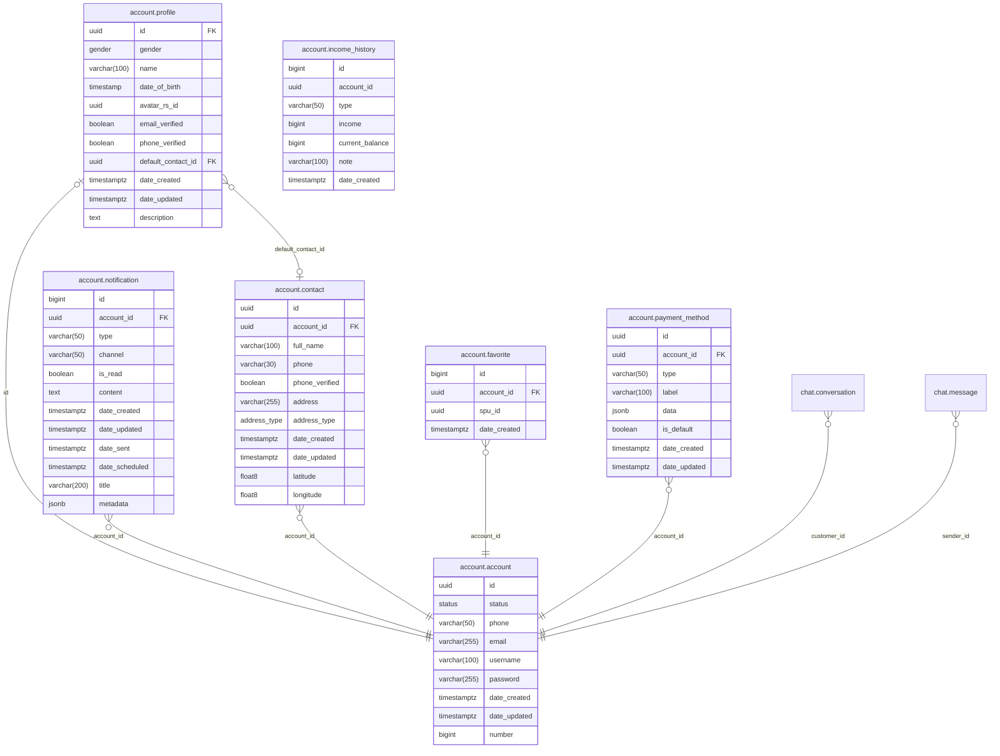

# Account Module

Handles user identity, authentication, and account-related data. Accounts are **unified** -- any account can act as both buyer and seller. There are no separate customer/vendor account types.

**Struct**: `AccountHandler` | **Interface**: `AccountBiz` | **Restate service**: `Account`

---

## Features

### Authentication
- Register and login with email, phone, or username + password (bcrypt).
- JWT access tokens (HS512) with refresh token rotation using a separate signing secret.

### Profile
- Name, gender, date of birth, avatar (linked to resource management), description.
- Email and phone verification status tracking.

### Contacts
- Multiple shipping addresses per account (full name, phone, address, address type: Home/Work).
- First contact auto-set as default. Configurable default via profile.

### Favorites
- Add/remove SPUs to a wishlist. Paginated listing. Batch check if SPUs are favorited.
- Idempotent add -- returns existing record if already favorited.

### Payment Methods
- CRUD with JSONB data for flexible provider metadata.
- Exactly-one-default enforcement via partial unique index (`WHERE is_default = true`).
- Default swap wrapped in a transaction.

### Notifications
- Per-account notifications with type, channel, content, read tracking.
- Scheduled delivery support. Unread count endpoint.
- Mark individual or all notifications as read.

### Account Management
- `SuspendAccount` sets status to `Suspended` (soft delete, no row removal).

---

## Database Tables

All tables in the `account` schema.

| Table | Key Columns | Notes |
|-------|-------------|-------|
| `account` | id (UUID), number (identity), status, phone, email, username, password | Unique on phone, email, username |
| `profile` | id (FK to account), gender, name, description, date_of_birth, avatar_rs_id, default_contact_id | 1:1 with account |
| `contact` | id, account_id, full_name, phone, address, address_type | Multiple per account |
| `favorite` | id, account_id, spu_id | Unique on (account_id, spu_id) |
| `payment_method` | id, account_id, type, label, data (JSONB), is_default | Partial unique index for default |
| `notification` | id, account_id, type, channel, is_read, content, date_scheduled | Indexed on account, type, channel |
| `income_history` | id, account_id, type, income, current_balance, note | Append-only earnings ledger |

---

## Endpoints

All routes prefixed with `/api/v1/account`.

### Auth (no auth required)

| Method | Path | Description |
|--------|------|-------------|
| POST | `/auth/login/basic` | Login with identifier + password, returns tokens |
| POST | `/auth/register/basic` | Register new account, returns tokens |
| POST | `/auth/refresh` | Exchange refresh token for new token pair |

### Profile

| Method | Path | Description |
|--------|------|-------------|
| GET | `/` | Get another account's profile by `account_id` query param |
| GET | `/me` | Get authenticated user's full profile |
| PATCH | `/me` | Update profile fields |

### Contacts

| Method | Path | Description |
|--------|------|-------------|
| GET | `/contact` | List all contacts |
| GET | `/contact/:contact_id` | Get specific contact |
| POST | `/contact` | Create contact (auto-default if first) |
| PATCH | `/contact` | Update contact |
| DELETE | `/contact` | Delete contact |

### Favorites

| Method | Path | Description |
|--------|------|-------------|
| POST | `/favorite/:spu_id` | Add SPU to favorites (idempotent) |
| DELETE | `/favorite/:spu_id` | Remove SPU from favorites |
| GET | `/favorite` | List favorites (paginated) |

### Payment Methods

| Method | Path | Description |
|--------|------|-------------|
| POST | `/payment-method` | Create payment method |
| GET | `/payment-method` | List payment methods (default first) |
| PATCH | `/payment-method` | Update payment method |
| DELETE | `/payment-method` | Delete payment method |
| PUT | `/payment-method/:id/default` | Set as default |

### Notifications

| Method | Path | Description |
|--------|------|-------------|
| GET | `/notification` | List notifications (paginated) |
| GET | `/notification/unread-count` | Get unread notification count |
| POST | `/notification/read` | Mark specific notifications as read |
| POST | `/notification/read-all` | Mark all notifications as read |

## ER Diagram

