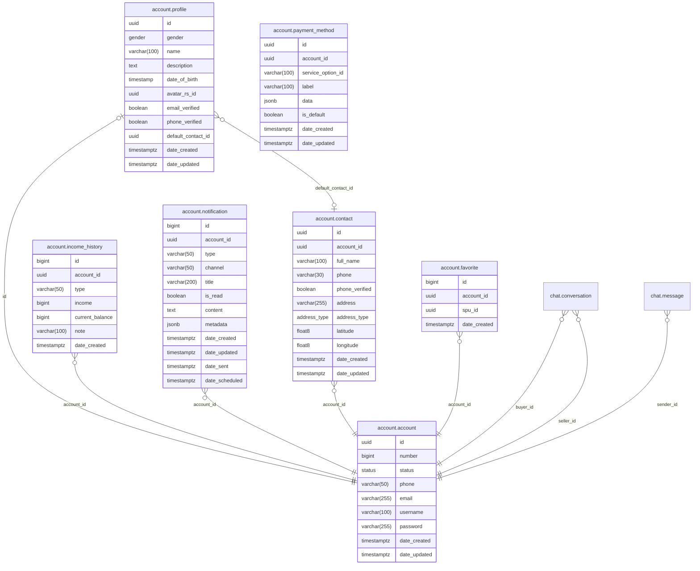

# Account Module

Handles user identity, authentication, and account-related data. Accounts are **unified** — any account can act as both buyer and seller. There are no separate customer/vendor account types.

**Handler**: `AccountHandler` | **Interface**: `AccountBiz` | **Restate service**: `"Account"`

## ER Diagram

<!--START_SECTION:mermaid-->

<!--END_SECTION:mermaid-->

## Domain Concepts

### Authentication

Register and login with email, phone, or username + password (bcrypt). JWT access tokens (HS512) with refresh token rotation using a separate signing secret.

### Profile

One-to-one with account. Tracks name, gender, date of birth, avatar (linked to resource management via `avatar_rs_id`), description, and email/phone verification status.

### Contacts

Multiple shipping addresses per account with full name, phone, address, and type (Home/Work). The first contact is auto-set as default. The default contact is referenced by the profile and used as the seller's shipping origin during order confirmation.

### Favorites

Wishlist of SPUs. Add is idempotent — returns the existing record if already favorited. Supports batch check ("are these SPUs favorited?") for product card rendering.

### Payment Methods

Flexible provider metadata stored as JSONB. Exactly-one-default enforced via a partial unique index (`WHERE is_default = true`). Default swap is wrapped in a transaction to prevent two defaults from coexisting.

### Notifications

Per-account notifications with type, channel, content, and read tracking. Supports scheduled delivery. Unread count endpoint for badge rendering.

### Income History

Append-only earnings ledger. Each entry records the transaction type, income delta, and resulting balance.

## Implementation Notes

- **Refresh token rotation**: access and refresh tokens use different signing secrets. On refresh, both tokens are re-issued — the old refresh token is implicitly invalidated by its expiry.
- **Partial unique index**: `CREATE UNIQUE INDEX ... WHERE is_default = true` ensures at most one default payment method per account at the database level, avoiding application-level race conditions.
- **Account suspension**: `SuspendAccount` sets status to `Suspended` (soft delete, no row removal). Suspended accounts cannot authenticate.

## Endpoints

All routes prefixed with `/api/v1/account`.

### Auth (no auth required)

| Method | Path | Description |
|--------|------|-------------|
| POST | `/auth/login/basic` | Login with identifier + password, returns tokens |
| POST | `/auth/register/basic` | Register new account, returns tokens |
| POST | `/auth/refresh` | Exchange refresh token for new token pair |

### Profile

| Method | Path | Description |
|--------|------|-------------|
| GET | `` | Get another account's profile by `account_id` query param |
| GET | `/me` | Get authenticated user's full profile |
| PATCH | `/me` | Update profile fields |

### Contacts

| Method | Path | Description |
|--------|------|-------------|
| GET | `/contact` | List all contacts |
| GET | `/contact/:contact_id` | Get specific contact |
| POST | `/contact` | Create contact (auto-default if first) |
| PATCH | `/contact` | Update contact |
| DELETE | `/contact` | Delete contact |

### Favorites

| Method | Path | Description |
|--------|------|-------------|
| POST | `/favorite/:spu_id` | Add SPU to favorites (idempotent) |
| DELETE | `/favorite/:spu_id` | Remove SPU from favorites |
| GET | `/favorite` | List favorites (paginated) |

### Payment Methods

| Method | Path | Description |
|--------|------|-------------|
| POST | `/payment-method` | Create payment method |
| GET | `/payment-method` | List payment methods (default first) |
| PATCH | `/payment-method` | Update payment method |
| DELETE | `/payment-method` | Delete payment method |
| PUT | `/payment-method/:id/default` | Set as default |
| POST | `/payment-method/tokenize` | Tokenize a card for a payment provider |

### Notifications

| Method | Path | Description |
|--------|------|-------------|
| GET | `/notification` | List notifications (paginated) |
| GET | `/notification/unread-count` | Get unread notification count |
| POST | `/notification/read` | Mark specific notifications as read |
| POST | `/notification/read-all` | Mark all notifications as read |

## Cross-Module Dependencies

| Module | Usage |
|--------|-------|
| `common` | Resource management for avatar images |

## Profile Settings

`account.profile.settings` is a JSONB column holding user preferences.
Typed view: `accountmodel.ProfileSettings`. Unknown keys are preserved
across updates via a load-merge-write pattern.

Update via `PATCH /api/v1/account/me/settings`. Only the authenticated
user can modify their own settings.

Current fields:
- `preferred_currency` — ISO 4217 code, validated against
  `config.App.Exchange.Supported` whitelist and the `iso4217` custom
  validator tag (format-only regex).
