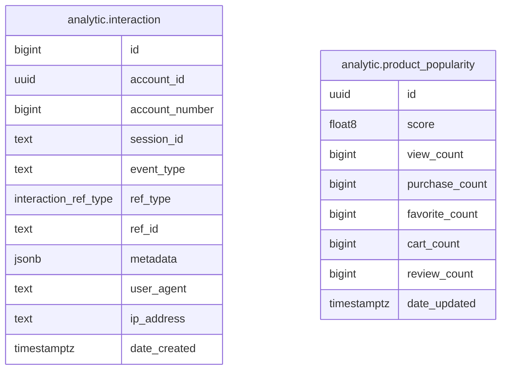

# Analytic Module

Tracks user interactions and computes real-time product popularity scores. Interactions are recorded via Restate durable execution, then fanned out to popularity scoring and catalog recommendation updates using fire-and-forget calls.

**Handler**: `AnalyticHandler` | **Interface**: `AnalyticBiz` | **Restate service**: `"Analytic"`

## ER Diagram

<!--START_SECTION:mermaid-->

<!--END_SECTION:mermaid-->

## Domain Concepts

### Interactions

User actions (views, purchases, reviews, cart adds, etc.) recorded as rows in `analytic.interaction`. Each interaction captures the account, session, event type, and a polymorphic reference (`ref_type` + `ref_id`) pointing to either a Product or Category.

### Product Popularity

An aggregate score per SPU that reflects overall engagement. Each event type has a configurable weight (positive or negative). The score is updated atomically — no read-before-write — via `INSERT ... ON CONFLICT DO UPDATE` with PostgreSQL arithmetic.

## Flows

### Interaction → Scoring Fan-Out

1. **`CreateInteraction`** batch-inserts interaction rows into PostgreSQL.
2. For each inserted row, fires two durable Restate calls (fire-and-forget):
   - `Analytic.HandlePopularityEvent` — updates the product popularity score.
   - `Catalog.AddInteraction` — feeds the recommendation engine.
3. **`HandlePopularityEvent`** filters for product-scoped events, looks up the event weight, and performs an atomic upsert to accumulate the score and increment the relevant counter.

Events not in the weight map are silently skipped.

## Implementation Notes

- **Fire-and-forget fan-out**: `restate.ServiceSend()` ensures each scoring and recommendation update is durable and exactly-once, even if the server crashes after inserting interactions but before processing them.
- **Atomic upsert**: popularity scoring uses `INSERT ... ON CONFLICT DO UPDATE SET score = score + $weight, view_count = view_count + 1` — no read-before-write means no lost updates under concurrency.
- **Configurable weights**: event weights are loaded from `PopularityWeights` config. Defaults range from +0.80 (purchase) to -1.20 (report_product). Negative weights allow the system to organically demote problematic products.

## Event Weight Table

| Event Type | Weight | Counter |
|------------|--------|---------|
| `purchase` | +0.80 | purchase_count |
| `add_to_favorites` | +0.60 | favorite_count |
| `add_to_cart` | +0.50 | cart_count |
| `write_review` | +0.50 | review_count |
| `rating_high` | +0.40 | review_count |
| `view` | +0.30 | view_count |
| `ask_question` | +0.25 | — |
| `click_from_search` | +0.20 | — |
| `click_from_recommendation` | +0.15 | — |
| `view_similar_products` | +0.15 | — |
| `click_from_category` | +0.12 | — |
| `rating_medium` | +0.10 | review_count |
| `view_bounce` | -0.10 | view_count |
| `not_interested` | -0.30 | — |
| `remove_from_cart` | -0.30 | cart_count |
| `hide_item` | -0.35 | — |
| `rating_low` | -0.50 | review_count |
| `dislike` | -0.50 | — |
| `return_product` | -0.60 | — |
| `cancel_order` | -0.60 | — |
| `refund_requested` | -0.70 | — |
| `report_product` | -1.20 | — |

## Endpoints

All routes prefixed with `/api/v1/analytic`.

| Method | Path | Description |
|--------|------|-------------|
| POST | `/interaction` | Record one or more interaction events |
| GET | `/popularity/top` | List top products by popularity score (paginated) |
| GET | `/popularity/:spu_id` | Get popularity data for a specific product |
| GET | `/seller-dashboard` | Seller sales and revenue dashboard (`?start=`, `?end=`, `?granularity=`) |

## Cross-Module Dependencies

| Module | Usage |
|--------|-------|
| `catalog` | Feeds recommendation engine via `Catalog.AddInteraction` fire-and-forget |
