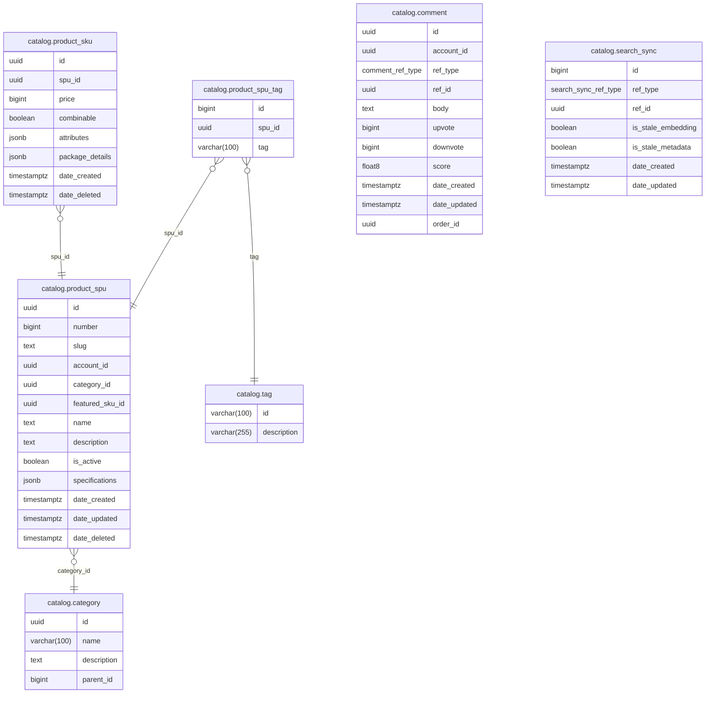

# Catalog Module

Product catalog with SPU/SKU model, categories, tags, comments/reviews, hybrid search, and personalized recommendations.

**Handler**: `CatalogHandler` | **Interface**: `CatalogBiz` | **Restate service**: `"Catalog"`

## ER Diagram

<!--START_SECTION:mermaid-->

<!--END_SECTION:mermaid-->

## Domain Concepts

### SPU / SKU Model

- **SPU** (Standard Product Unit) — the abstract product concept: name, description, category, specifications, tags. Owned by an account (`account_id`).
- **SKU** (Stock Keeping Unit) — a purchasable variant with price, attributes (e.g., color, size), and package details (weight, dimensions). Each SPU has one or more SKUs.
- **Featured SKU** — each SPU designates one SKU as `featured_sku_id`, used for price display on product cards.

### Comments

Polymorphic via `ref_type`: `ProductSpu` for product reviews, `Comment` for replies. Score is 0.0–1.0 (sentiment). Reviews are tied to a specific `order_id` to prevent duplicate reviews per purchase. Upvote/downvote counters are tracked per comment.

### Tags and Categories

Tags are free-form labels, lazily created on SPU create/update (if a tag doesn't exist, it's auto-created). Categories form a hierarchy via `parent_id`.

### Search Sync

The `search_sync` table tracks which SPUs need re-indexing in Milvus. Two boolean flags distinguish metadata-only updates (name, price, tags) from full embedding regeneration.

## Flows

### Hybrid Search

Search combines dense vector similarity and sparse BM25 scoring via Milvus, with configurable weights:

1. Query text is embedded by a pluggable LLM provider (Python/OpenAI/Bedrock) into a dense vector.
2. Milvus runs both dense (vector similarity) and sparse (BM25 built-in analyzer) searches.
3. Results are merged with configurable dense/sparse weight ratio.
4. Falls back to PostgreSQL `ILIKE` on `slug`, `name`, `description` if Milvus is unavailable.

### Recommendation

1. Personalized feed cached in Redis sorted sets (`catalog:recommend:product:{account_id}`).
2. User interactions (views, purchases, reviews) buffered in-memory, flushed in batches to Milvus.
3. Falls back to most-sold products (via inventory module) when recommendations are insufficient.

### Background Sync

Two goroutines sync stale products from `search_sync` to Milvus:

| Cron | Batch Size | Syncs |
|------|-----------|-------|
| Metadata | 1000 | Name, price, tags, category (skips embedding regen) |
| Embedding | 32 | Full re-index including vector embedding |

## Implementation Notes

- **Milvus direct**: search talks to Milvus directly, no external search service layer. The catalog module owns the full search pipeline.
- **`FOR UPDATE SKIP LOCKED`**: background sync crons use this pattern for concurrent-safe batch processing — multiple instances won't process the same stale records.
- **Pluggable LLM embedding**: the embedding provider is injected via the `llm.Client` interface. Switching from OpenAI to Bedrock is a config change, not a code change.
- **Lazy tag creation**: tags are created on-the-fly during SPU create/update. No separate "create tag" step required from the frontend.

## Endpoints

All under `/api/v1/catalog`.

### Product Detail and Cards

| Method | Path | Description |
|--------|------|-------------|
| GET | `/product-detail` | Full product detail by `id` or `slug` query param |
| GET | `/product-card` | List product cards with pagination, `vendor_id`, `search` filters |
| GET | `/product-card/recommended` | Personalized recommendations with most-sold fallback |
| GET | `/product-card/:id` | Single product card by ID |

### Product SPU

| Method | Path | Description |
|--------|------|-------------|
| GET | `/product-spu` | List with filters (category, is_active) |
| GET | `/product-spu/:id` | Get by UUID |
| POST | `/product-spu` | Create with tags, resources, specifications |
| PATCH | `/product-spu` | Partial update |
| DELETE | `/product-spu/:id` | Delete |

### Product SKU

| Method | Path | Description |
|--------|------|-------------|
| GET | `/product-sku` | List by `spu_id` with price/combinable filters |
| POST | `/product-sku` | Create (also provisions inventory stock) |
| PATCH | `/product-sku` | Update price, attributes, package details |
| DELETE | `/product-sku` | Delete |

### Comments

| Method | Path | Description |
|--------|------|-------------|
| GET | `/comment` | List by `ref_type` + `ref_id`, score filters |
| POST | `/comment` | Create review/reply with score and resources |
| PATCH | `/comment` | Update body, score, resources |
| DELETE | `/comment` | Delete by list of IDs |
| POST | `/comment/vote` | Upvote or downvote a comment |
| GET | `/comment/reviewable-orders` | List orders eligible for review |

### Tags, Categories

| Method | Path | Description |
|--------|------|-------------|
| GET | `/tag` | List with optional `search` (ILIKE) |
| GET | `/tag/:tag` | Get single tag |
| GET | `/category` | List with optional `search` |
| GET | `/category/:id` | Get single category |

### Vendor Stats

| Method | Path | Description |
|--------|------|-------------|
| GET | `/vendor-stats` | Aggregate stats for the authenticated vendor |

## Cross-Module Dependencies

| Module | Usage |
|--------|-------|
| `common` | Resource/image management for SPU, SKU, and comment attachments |
| `account` | Author profile lookups for comment display |
| `inventory` | Stock creation for new SKUs, sold counts for fallback recommendations |
| `promotion` | Price calculation with active promotions for product cards |
| `analytic` | Interaction tracking (views, reviews, ratings) via fire-and-forget |
