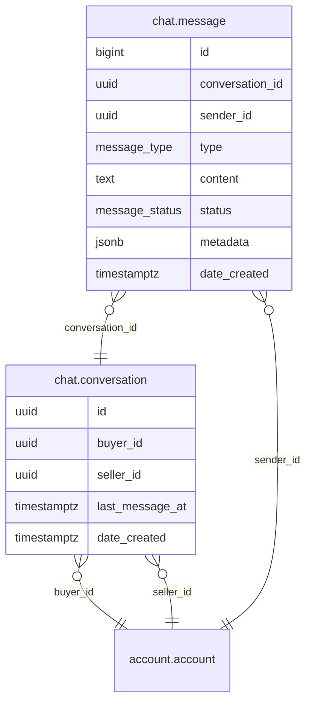

# Chat Module

Messaging between any two accounts. REST API for conversation management, message sending, and message history.

- **Struct**: `ChatHandler` | **Interface**: `ChatBiz` | **Service**: `"Chat"`
- **Schema**: `chat.*` in PostgreSQL

## ER Diagram

<!--START_SECTION:mermaid-->

<!--END_SECTION:mermaid-->

## Data Model

- **conversation** -- one per account pair, idempotent creation. Tracks `last_message_at` for recency ordering.
- **message** -- belongs to a conversation. Types: `Text`, `Image`, `System`. Status: `Sent`, `Delivered`, `Read`.

> **Note**: The conversation table uses legacy column names `customer_id`/`vendor_id`, but both reference `account.account`. There is no customer/vendor distinction -- any account can be either party.

## API Endpoints

All under `/api/v1/chat`. All require JWT authentication.

| Method | Path | Description |
|--------|------|-------------|
| POST | `/conversation` | Create conversation (or return existing) with another account |
| GET | `/conversation` | List conversations for authenticated account, ordered by recency |
| GET | `/conversation/:id/messages` | Paginated message history (newest first) |
| POST | `/send-message` | Send a message to a conversation |
| POST | `/mark-read` | Mark all unread messages from the other participant as read |

## Read Receipt System

- Each message has a `status` enum: `Sent` -> `Delivered` -> `Read`
- `POST /mark-read` bulk-updates all unread messages from the other participant
- `Delivered` status is reserved for future use
