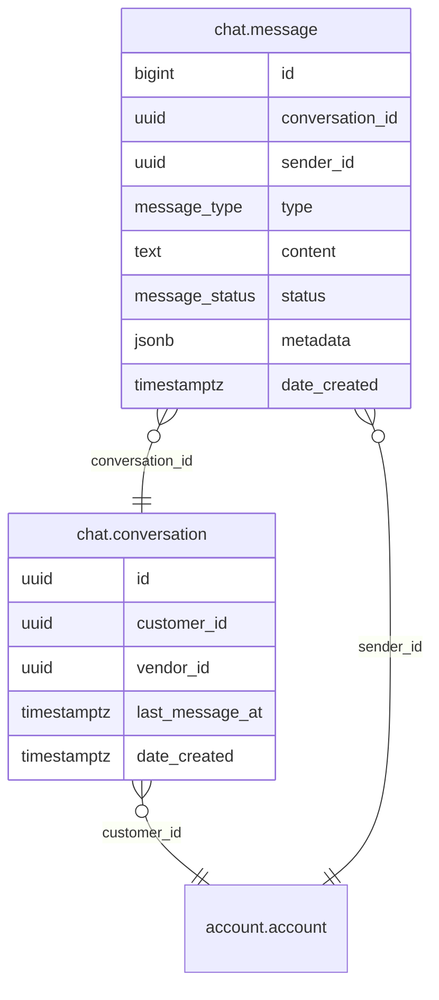

# Chat Module

Real-time messaging between any two accounts. REST API for conversation management and message history, WebSocket for live delivery.

- **Struct**: `ChatHandler` | **Interface**: `ChatBiz` | **Service**: `"Chat"`
- **Schema**: `chat.*` in PostgreSQL

## ER Diagram

<!--START_SECTION:mermaid-->

<!--END_SECTION:mermaid-->

## Data Model

- **conversation** -- one per account pair, idempotent creation. Tracks `last_message_at` for recency ordering.
- **message** -- belongs to a conversation. Types: `Text`, `Image`, `System`. Status: `Sent`, `Delivered`, `Read`.

> **Note**: The conversation table uses legacy column names `customer_id`/`vendor_id`, but both reference `account.account`. There is no customer/vendor distinction -- any account can be either party.

## API Endpoints

All under `/api/v1/chat`. All require JWT authentication.

| Method | Path | Description |
|--------|------|-------------|
| POST | `/conversation` | Create conversation (or return existing) with another account |
| GET | `/conversation` | List conversations for authenticated account, ordered by recency |
| GET | `/conversation/:id/messages` | Paginated message history (newest first) |

## WebSocket

**Endpoint**: `GET /ws/chat` (JWT authenticated via upgrade handshake)

Connected clients are tracked in an in-memory map keyed by account UUID with `sync.RWMutex` for concurrency.

### Client-to-Server Messages

| Type | Data Fields | Description |
|------|-------------|-------------|
| `send_message` | `conversation_id`, `type`, `content`, `metadata?` | Send a message |
| `mark_read` | `conversation_id` | Mark other participant's messages as read |

### Server-to-Client Messages

| Type | Data Fields | Description |
|------|-------------|-------------|
| `new_message` | Full message object | Sent to both participants on message send |
| `read_receipt` | `conversation_id`, `reader_id` | Notifies other participant of read |
| `error` | `message` | Error notification |

## Read Receipt System

- Each message has a `status` enum: `Sent` -> `Delivered` -> `Read`
- `mark_read` bulk-updates all unread messages from the other participant
- `read_receipt` event is pushed in real-time to the other participant if online
- `Delivered` status is reserved for future use

## Offline Handling

No offline queue. Messages are always persisted to PostgreSQL. Clients retrieve missed messages via the paginated REST endpoint on reconnect.
