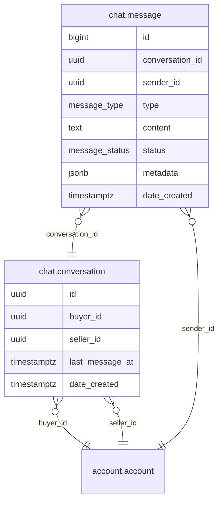

# Chat Module

Messaging between any two accounts. REST API for conversation management, message sending, and message history.

**Handler**: `ChatHandler` | **Interface**: `ChatBiz` | **Restate service**: `"Chat"`

## ER Diagram

<!--START_SECTION:mermaid-->

<!--END_SECTION:mermaid-->

## Domain Concepts

### Conversations

One conversation per account pair, created idempotently — calling "create conversation" with the same two accounts returns the existing one. Conversations track `last_message_at` for recency ordering in the inbox.

### Messages

Each message belongs to a conversation and has a type (`Text`, `Image`, `System`) and a status (`Sent`, `Delivered`, `Read`). The `metadata` JSONB field stores type-specific data (e.g., image URLs for Image messages).

### Read Receipts

`POST /mark-read` bulk-updates all unread messages from the other participant in a conversation. The `Delivered` status exists in the enum but is reserved for future use (e.g., push notification delivery confirmation).

## Implementation Notes

- **Legacy column names**: the conversation table uses `customer_id`/`vendor_id` columns, but both reference `account.account`. There is no customer/vendor distinction — any account can be either party.
- **Idempotent creation**: conversation create checks for an existing conversation between the two accounts (in either direction) before inserting, preventing duplicates.

## Endpoints

All under `/api/v1/chat`. All require JWT authentication.

| Method | Path | Description |
|--------|------|-------------|
| POST | `/conversation` | Create conversation (or return existing) with another account |
| GET | `/conversation` | List conversations for authenticated account, ordered by recency |
| GET | `/conversation/:id/messages` | Paginated message history (newest first) |
| POST | `/send-message` | Send a message to a conversation |
| POST | `/mark-read` | Mark all unread messages from the other participant as read |

## Cross-Module Dependencies

| Module | Usage |
|--------|-------|
| `account` | Account lookup for conversation participants |
