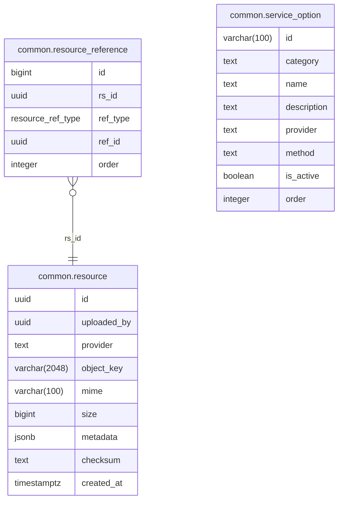

# Common Module

Shared infrastructure services: resource management, object storage, service options registry, and geocoding.

- **Struct**: `CommonHandler` | **Interface**: `CommonBiz` | **Service**: `"Common"`
- **Schema**: `common.*` in PostgreSQL

## ER Diagram

<!--START_SECTION:mermaid-->

<!--END_SECTION:mermaid-->

## Core Responsibilities

### Resource Management

Polymorphic file attachments for any entity via a `resource_reference` join table with `ref_type` enum discriminator (`ProductSpu`, `ProductSku`, `Refund`, `ReturnDispute`, `Comment`). Each resource tracks provider, object key, MIME type, size, and checksum.

- `UpdateResources` -- transactional replace-all: deletes existing refs, verifies new resource IDs, re-creates in order
- `DeleteResources` -- removes refs and optionally the underlying resource records
- `GetResources` -- returns ordered resources per entity as a map of `refID -> []Resource` with resolved URLs

### Object Storage

Three backends initialized on startup, registered as service options:

| Provider | Description |
|----------|-------------|
| `local` | Local filesystem (`./tmp/uploads`) |
| `s3` | AWS S3 or MinIO with optional CloudFront CDN |
| `remote` | Passthrough for externally-hosted URLs |

Each resource record tracks its `provider`, so URLs resolve against the correct backend. Falls back to a configurable placeholder image on resolution failure.

### Service Options Registry

Generic registry for configurable providers (payment, transport, objectstore). Each option has an ID, category, provider, method, name, and description. Auto-synced on module startup. Other modules call `UpdateServiceOptions` to register their providers.

### Geocoding

Reverse/forward geocoding and location search via a pluggable provider interface. Currently uses Nominatim (OpenStreetMap).

## API Endpoints

All under `/api/v1/common`.

| Method | Path | Auth | Description |
|--------|------|------|-------------|
| POST | `/files` | Yes | Upload file via multipart/form-data, returns resource with URL |
| GET | `/option` | No | List active service options by `category` query param |
| POST | `/geocode/reverse` | No | Convert lat/lng to address (`latitude`, `longitude` body) |
| POST | `/geocode/forward` | No | Convert address to lat/lng (`address` body) |
| GET | `/geocode/search` | No | Location suggestions for partial query (`q`, `limit` params) |
