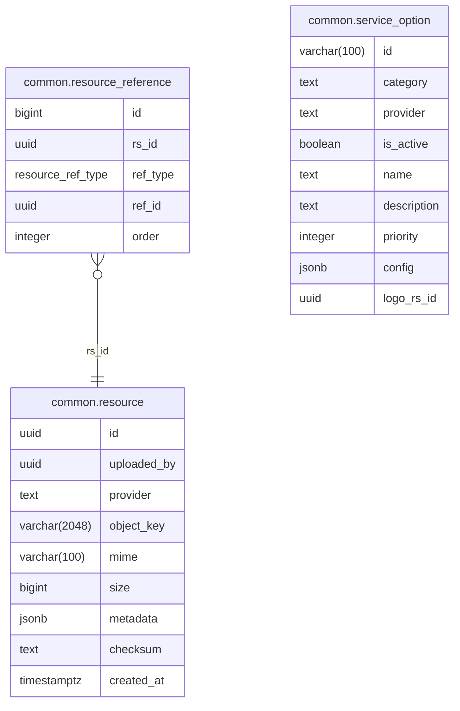

# Common Module

Shared infrastructure services: resource management, object storage, service options registry, geocoding, and server-sent events.

**Handler**: `CommonHandler` | **Interface**: `CommonBiz` | **Restate service**: `"Common"`

## ER Diagram

<!--START_SECTION:mermaid-->

<!--END_SECTION:mermaid-->

## Domain Concepts

### Resource Management

Polymorphic file attachments for any entity via a `resource_reference` join table. The `ref_type` enum discriminator (`ProductSpu`, `ProductSku`, `Refund`, `ReturnDispute`, `Comment`) links resources to their owning entity without foreign keys. Each resource tracks its storage provider, object key, MIME type, size, and checksum.

Resources are ordered per entity — the `order` column on `resource_reference` controls display order (e.g., first image is the product thumbnail).

### Object Storage

Three backends, each registered as a service option at startup:

| Provider | Description |
|----------|-------------|
| `local` | Local filesystem (`./tmp/uploads`) |
| `s3` | AWS S3 or MinIO with optional CloudFront CDN |
| `remote` | Passthrough for externally-hosted URLs |

Each resource record tracks its `provider`, so URLs resolve against the correct backend. Falls back to a configurable placeholder image on resolution failure.

### Service Options Registry

A generic registry for configurable providers (payment, transport, objectstore). Each option has an ID, category, provider, name, description, and JSONB config. Other modules call `UpdateServiceOptions` to register their providers on startup — the registry auto-syncs.

### Geocoding

Reverse/forward geocoding and location search via a pluggable provider interface. Currently uses Nominatim (OpenStreetMap). Used by the account module for contact address resolution.

### Server-Sent Events (SSE)

Real-time event stream for push notifications, chat messages, and other live updates. Authenticates via `Authorization` header or `?token=` query param.

## Implementation Notes

- **Transactional replace-all**: `UpdateResources` deletes existing refs, verifies new resource IDs exist, and re-creates refs in order — all within a single transaction. This simplifies the frontend: just send the full list of resource IDs in the desired order.
- **Auto-sync on startup**: each module registers its providers by calling `UpdateServiceOptions` during fx initialization. The registry upserts by ID, so restarts don't create duplicates.
- **Placeholder fallback**: if a resource URL can't be resolved (deleted file, broken S3 link), the system returns a configurable placeholder image URL instead of failing.

## Endpoints

All under `/api/v1/common`.

| Method | Path | Description |
|--------|------|-------------|
| POST | `/files` | Upload file via multipart/form-data, returns resource with URL |
| GET | `/option` | List active service options by `category` query param |
| POST | `/geocode/reverse` | Convert lat/lng to address |
| POST | `/geocode/forward` | Convert address to lat/lng |
| GET | `/geocode/search` | Location suggestions for partial query (`q`, `limit` params) |
| GET | `/stream` | SSE stream for real-time events |

## Exchange Rates

Goroutine + `time.Ticker` cron (`CommonHandler.SetupExchangeCron`) fetches
rates from Frankfurter every 6h (configurable via `exchange.refresh_interval`).
Rates are stored in `common.exchange_rate` keyed on `(base, target)`.

Use the `ConvertAmount` biz method for backend-side cross-currency math.
Frontend reads the snapshot via `GET /api/v1/common/currencies/rates`.

Config keys (under `app.exchange`):
- `base` — storage base currency (USD)
- `supported` — whitelist of supported codes
- `refreshInterval` — cron interval
- `httpTimeout` — upstream HTTP timeout
- `defaultUserCurrency` — new-profile default
- `upstreamURL` — Frankfurter endpoint
