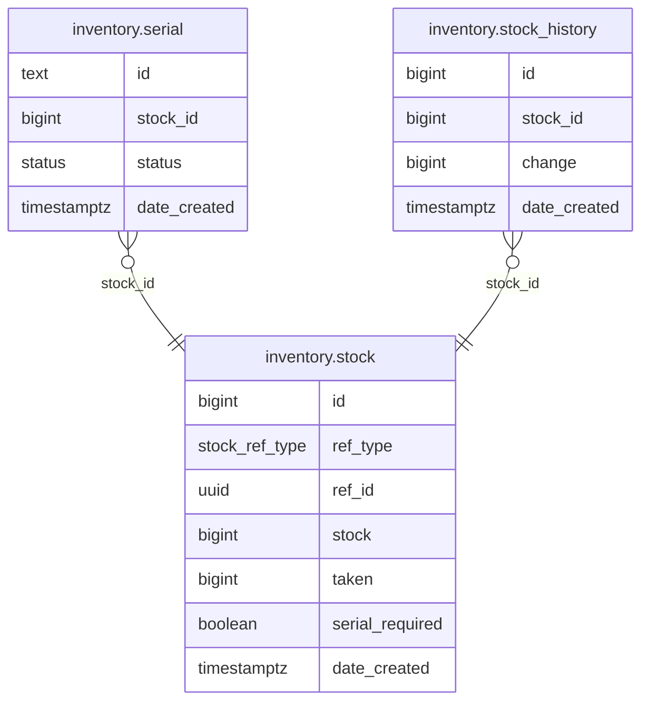

# Inventory Module

Stock management with serial number tracking and audit trail.

**Struct:** `InventoryHandler` | **Interface:** `InventoryBiz` | **Restate service:** `Inventory`

## ER Diagram

<!--START_SECTION:mermaid-->

<!--END_SECTION:mermaid-->

## Key Concepts

- **Polymorphic references** -- `(ref_type, ref_id)` associates stock/serials with `ProductSku` or `Promotion` entities without separate tables per type.
- **Serial tracking** -- when `serial_required` is true on a stock record, individual serial IDs are tracked and assigned during reservation.
- **Audit trail** -- every stock change (import, adjustment) creates a `stock_history` record with the signed delta.

## Core Operations

- **ImportStock** -- adds stock quantity, creates serial records (vendor-provided IDs or auto-generated UUIDs), records history entry. Uses PostgreSQL `COPY FROM` for bulk serial inserts.
- **ReserveInventory** -- called during checkout. Decrements stock, increments taken, assigns serial IDs when required. Uses `FOR UPDATE SKIP LOCKED` for serial allocation.
- **ReleaseInventory** -- called when items are rejected/cancelled. Restores stock counters and serial statuses.

### SKIP LOCKED Pattern

Serial reservation uses `FOR UPDATE SKIP LOCKED` so concurrent checkouts never block each other. Transaction A locks serials 1-3; Transaction B silently skips those and gets serials 4-6. No deadlocks, no contention.

## Tables

`inventory.stock` (aggregated counters per ref), `inventory.serial` (individual serial IDs), `inventory.stock_history` (append-only audit log)

## API Endpoints

### Stock

| Method | Path | Handler | Description |
|--------|------|---------|-------------|
| GET | `/api/v1/inventory/stock` | GetStock | Get stock by ref_id + ref_type |
| PATCH | `/api/v1/inventory/stock` | UpdateStockSettings | Update stock settings (e.g. serial_required) |
| GET | `/api/v1/inventory/stock/history` | ListStockHistory | Paginated stock change history |
| POST | `/api/v1/inventory/stock/import` | ImportStock | Import stock with optional serial IDs |

### Serial

| Method | Path | Handler | Description |
|--------|------|---------|-------------|
| GET | `/api/v1/inventory/serial` | ListSerial | Paginated serial list by stock_id |
| PATCH | `/api/v1/inventory/serial` | UpdateSerial | Batch-update serial status |
