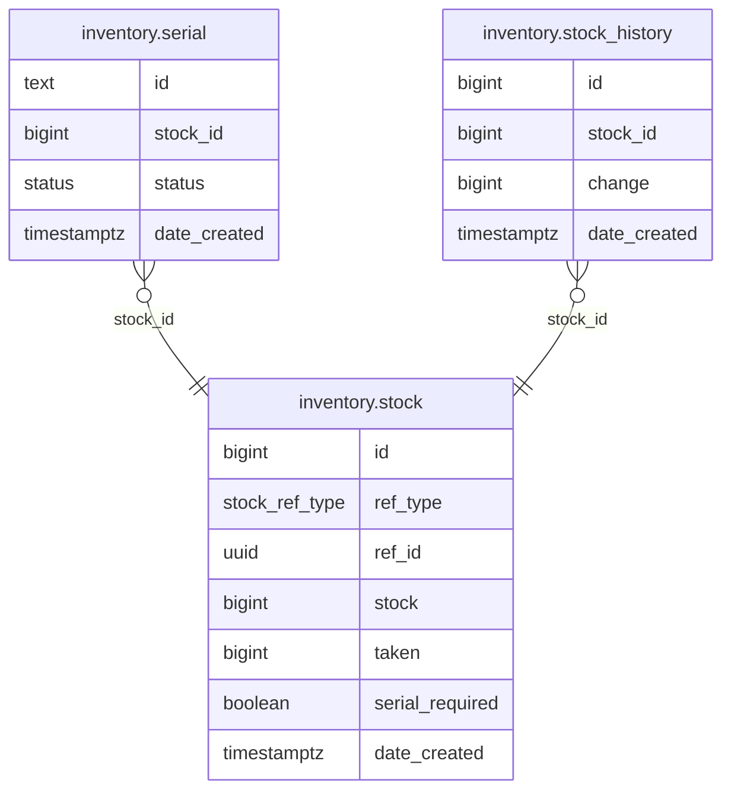

# Inventory Module

Stock management with serial number tracking and audit trail. Provides reserve/release operations consumed by the order module during checkout and cancellation.

**Handler**: `InventoryHandler` | **Interface**: `InventoryBiz` | **Restate service**: `"Inventory"`

## ER Diagram

<!--START_SECTION:mermaid-->

<!--END_SECTION:mermaid-->

## Domain Concepts

### Stock

Each stock record uses a polymorphic reference (`ref_type` + `ref_id`) to associate with a `ProductSku` or `Promotion` entity — no separate tables per type. Tracks two counters: `stock` (total available) and `taken` (currently reserved).

### Serial Tracking

When `serial_required` is true on a stock record, individual serial IDs are tracked. Serials can be vendor-provided (custom IDs) or auto-generated UUIDs. Each serial has a status (`Available`, `Reserved`, `Sold`, etc.) that transitions through the order lifecycle.

### Audit Trail

Every stock change (import, adjustment) creates a `stock_history` record with a signed delta (+50 for import, -3 for reservation). The history is append-only and serves as a complete audit log.

## Flows

### Stock Lifecycle

1. **ImportStock** — seller adds stock quantity. Creates serial records if `serial_required`. Records a positive history entry.
2. **ReserveInventory** — called during checkout. Decrements available stock, increments `taken`, assigns specific serial IDs when required.
3. **ReleaseInventory** — called when items are rejected/cancelled. Restores stock counters and resets serial statuses.

## Implementation Notes

- **`FOR UPDATE SKIP LOCKED`**: serial reservation uses this pattern so concurrent checkouts never block each other. Transaction A locks serials 1–3; Transaction B silently skips those and gets serials 4–6. No deadlocks, no contention.
- **`COPY FROM` for bulk inserts**: `ImportStock` uses PostgreSQL's `COPY FROM` protocol (via pgx `CopyFrom`) for bulk serial inserts — significantly faster than individual INSERT statements for large batches.
- **Signed delta history**: stock_history records use a signed `change` column (+N for imports, -N for reservations). Summing all history entries for a stock ID should equal the current `stock` value, providing a built-in consistency check.

## Endpoints

All under `/api/v1/inventory`.

### Stock

| Method | Path | Description |
|--------|------|-------------|
| GET | `/stock` | Get stock by `ref_id` + `ref_type` |
| PATCH | `/stock` | Update stock settings (e.g., `serial_required`) |
| GET | `/stock/history` | Paginated stock change history |
| POST | `/stock/import` | Import stock with optional serial IDs |

### Serial

| Method | Path | Description |
|--------|------|-------------|
| GET | `/serial` | Paginated serial list by `stock_id` |
| PATCH | `/serial` | Batch-update serial status |

## Cross-Module Dependencies

| Module | Usage |
|--------|-------|
| `catalog` | Provides sold counts for recommendation fallback |
