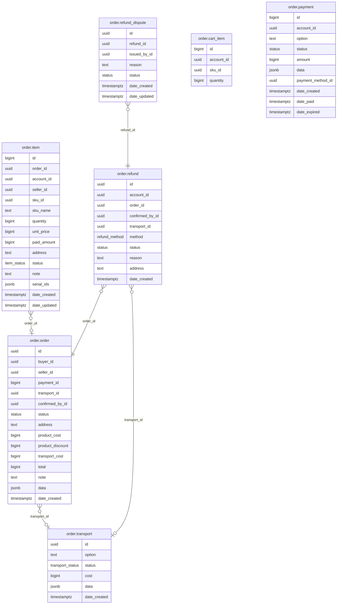

# Order Module

Manages the full order lifecycle: cart, checkout, seller confirmation, payment, cancellation, and refunds.

**Struct:** `OrderHandler` | **Interface:** `OrderBiz` | **Restate service:** `Order`

## ER Diagram

<!--START_SECTION:mermaid-->

<!--END_SECTION:mermaid-->


## Key Concepts

- **No customer/vendor distinction** -- any account can buy and sell. Orders track `buyer_id` and `seller_id` per transaction.
- **Checkout creates pending items**, not orders. Inventory is reserved and cart items are removed.
- **Sellers create orders** by confirming incoming pending items via `ConfirmSellerPending`, which creates a transport and groups items into an order.
- **Payment is separate** -- `payment_id` on orders is nullable until the buyer calls `PayBuyerOrders`.
- **Pluggable providers** -- payment and transport providers are registered at startup in `map[string]Client` maps, selected by option string.

## Order Flow

```
Cart -> Checkout (pending items) -> Seller confirms (creates order + transport)
     -> Buyer pays (PayBuyerOrders) -> Delivery -> (optional) Refund
```

1. **Checkout** (`BuyerCheckout`): reserves inventory, removes from cart, creates pending `order.item` records (no order yet)
2. **Buyer pending**: buyer lists (`ListBuyerPending`) and cancels (`CancelBuyerPending`) pending items (releases inventory)
3. **Seller incoming**: seller lists pending items (`ListSellerPending`), confirms selected items (`ConfirmSellerPending`, creates order + transport), or rejects them (`RejectSellerPending`, releases inventory)
4. **Payment**: buyer pays confirmed orders via `PayBuyerOrders` (creates payment, calls provider)
5. **Cancel**: buyer cancels unpaid orders via `CancelBuyerOrder` (releases inventory)
6. **Refund**: buyer requests refund on paid orders (PickUp/DropOff methods), seller confirms

## Tables

`order.cart_item`, `order.item`, `order.order`, `order.payment`, `order.transport`, `order.refund`, `order.refund_dispute`

## Providers

**Payment:** VNPay (QR/Bank/ATM), COD (`system-cod`)

**Transport:** GHTK (Express/Standard/Economy) -- mock implementation with cost based on weight and service tier

## API Endpoints

All endpoints under `/api/v1/order`. Routes follow a `buyer/seller` + `pending/confirmed` convention.

### Cart

| Method | Path | Handler | Description |
|--------|------|---------|-------------|
| GET | `/cart` | GetCart | List cart items |
| POST | `/cart` | UpdateCart | Add/update/remove cart item |
| DELETE | `/cart` | ClearCart | Remove all cart items |

### Buyer -- Pending

| Method | Path | Handler | Description |
|--------|------|---------|-------------|
| POST | `/buyer/checkout` | BuyerCheckout | Checkout items, reserve inventory, create pending items |
| GET | `/buyer/pending` | ListBuyerPending | List buyer's pending items (filterable by `status`) |
| DELETE | `/buyer/pending/:id` | CancelBuyerPending | Cancel a pending item (releases inventory) |

### Buyer -- Confirmed

| Method | Path | Handler | Description |
|--------|------|---------|-------------|
| GET | `/buyer/confirmed` | ListBuyerConfirmed | List buyer's orders (filterable by `status`) |
| GET | `/buyer/confirmed/:id` | GetBuyerOrder | Get order by ID |
| DELETE | `/buyer/confirmed/:id` | CancelBuyerOrder | Cancel unpaid order (releases inventory) |
| POST | `/buyer/pay` | PayBuyerOrders | Pay for confirmed orders |

### Buyer -- Refund

| Method | Path | Handler | Description |
|--------|------|---------|-------------|
| GET | `/buyer/refund` | ListBuyerRefunds | List refund requests |
| POST | `/buyer/refund` | CreateBuyerRefund | Create refund request (PickUp/DropOff) |
| PATCH | `/buyer/refund` | UpdateBuyerRefund | Update pending refund |
| DELETE | `/buyer/refund` | CancelBuyerRefund | Cancel pending refund |

### Seller -- Pending

| Method | Path | Handler | Description |
|--------|------|---------|-------------|
| GET | `/seller/pending` | ListSellerPending | List pending items for seller's products (filterable by `search`) |
| POST | `/seller/pending/confirm` | ConfirmSellerPending | Confirm items, create transport + order |
| POST | `/seller/pending/reject` | RejectSellerPending | Reject pending items (releases inventory) |

### Seller -- Confirmed

| Method | Path | Handler | Description |
|--------|------|---------|-------------|
| GET | `/seller/confirmed` | ListSellerConfirmed | List seller's orders (filterable by `search`, `order_status`, `payment_status`) |
| GET | `/seller/confirmed/:id` | GetSellerOrder | Get order by ID |

### Seller -- Refund

| Method | Path | Handler | Description |
|--------|------|---------|-------------|
| POST | `/seller/refund/confirm` | ConfirmSellerRefund | Seller confirms refund |

### Payment Webhooks

Payment providers register webhook routes at startup (e.g. VNPay IPN). These are mounted dynamically via `payment.Client.MountWebhookRoutes()`.

## Cross-Module Dependencies

| Module | Usage |
|--------|-------|
| `account` | Authenticated identity, seller default contacts, notifications |
| `catalog` | SPU/SKU lookup, pricing, package details |
| `inventory` | Reserve/release inventory during checkout |
| `promotion` | Price calculation with promotion codes |
| `common` | Resource management (refund images) |
