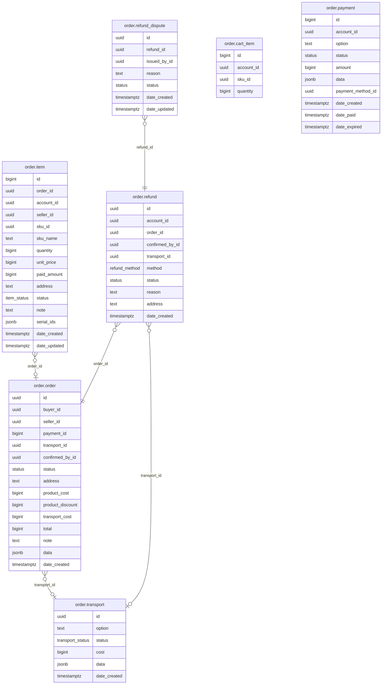

# Order Module

Manages the full order lifecycle: cart, checkout, seller confirmation, payment, delivery, cancellation, and refunds. The most complex module in the system — orchestrates inventory, transport, payment, and promotion modules.

**Handler**: `OrderHandler` | **Interface**: `OrderBiz` | **Restate service**: `"Order"`

## ER Diagram

<!--START_SECTION:mermaid-->

<!--END_SECTION:mermaid-->

## Domain Concepts

### Pending Items vs Orders

**Checkout creates pending items, not orders.** When a buyer checks out, the system reserves inventory and creates `order.item` records with `status = Pending` — but no `order.order` row exists yet. The seller then reviews incoming pending items and either confirms or rejects them.

**Sellers create orders** by confirming pending items via `ConfirmSellerPending`. This groups the confirmed items into an `order.order`, creates a transport record, and calculates the total cost (product cost - discount + transport cost). Only after confirmation does a proper "order" exist.

### Payment

Payment is separate from order creation. The `payment_id` on orders is nullable until the buyer calls `PayBuyerOrders`. A single payment can cover multiple orders. Payment providers are pluggable — each implements a `payment.Client` interface and is registered in `paymentMap` at startup.

### Transport

Transport providers are also pluggable via `transport.Client`. The seller selects a transport option when confirming pending items. The system calls `transportClient.Quote()` for cost estimation and `transportClient.Create()` when finalizing the order. Transport data (tracking ID, provider-specific metadata) is stored as JSONB.

### Refunds

Buyers request refunds on paid orders, choosing either PickUp (seller arranges pickup) or DropOff (buyer ships back). Refunds go through seller confirmation. Disputes can be raised against refunds.

## Flows

### Order Lifecycle

```
Cart → Checkout (pending items) → Seller confirms (creates order + transport)
     → Buyer pays (PayBuyerOrders) → Delivery → (optional) Refund
```

1. **Cart**: buyer adds SKUs to cart (`UpdateCart`). Cart is a simple quantity map.
2. **Checkout** (`BuyerCheckout`): validates SKUs, reserves inventory via the inventory module, removes items from cart, creates pending `order.item` records. Supports "buy now" mode (skip cart).
3. **Buyer pending**: buyer lists (`ListBuyerPending`) and can cancel (`CancelBuyerPending`) pending items, which releases the reserved inventory.
4. **Seller incoming**: seller views pending items for their products (`ListSellerPending`). Can preview costs via `QuoteTransport` before confirming. `ConfirmSellerPending` groups items into an order, creates a transport, and calculates totals. `RejectSellerPending` releases inventory.
5. **Payment** (`PayBuyerOrders`): buyer pays one or more confirmed orders. Creates a payment record, calls the payment provider. Provider webhook confirms success/failure.
6. **Refund**: buyer requests refund on a paid order (`CreateBuyerRefund`). Seller confirms (`ConfirmSellerRefund`). Buyer can update or cancel pending refunds.

### Payment Webhook Flow

1. `PayBuyerOrders` creates a payment record and redirects buyer to the provider's payment page.
2. Provider processes payment and calls the webhook (mounted dynamically via `payment.Client.MountWebhookRoutes()`).
3. `ConfirmPayment` updates the payment status and all associated orders.

## Implementation Notes

- **Pluggable provider maps**: `paymentMap` and `transportMap` are `map[string]payment.Client` and `map[string]transport.Client`, populated at startup from config. The provider string on each order/transport record is the map key.
- **Transport quote**: `QuoteTransport` calls `transportClient.Quote()` inside a `restate.Run()` closure for durability. This gives sellers a cost preview before confirming, including product cost, discount, transport cost, and total.
- **`restate.Run()` for side effects**: transport creation and payment provider calls are wrapped in `restate.Run()` to ensure they're journaled. If the process crashes after creating a transport but before updating the order, Restate replays and skips the already-completed transport creation.
- **Inventory coordination**: checkout reserves inventory via `inventory.ReserveInventory`. Cancellation (buyer cancel, seller reject) releases via `inventory.ReleaseInventory`. Both are cross-module Restate calls — durable and exactly-once.
- **Promotion integration**: during checkout, prices are calculated via `promotion.CalculatePromotedPrices`, which applies all applicable discounts and returns the effective price per SKU.

## Endpoints

All under `/api/v1/order`.

### Cart

| Method | Path | Description |
|--------|------|-------------|
| GET | `/cart` | List cart items |
| POST | `/cart` | Add/update/remove cart item |
| DELETE | `/cart` | Remove all cart items |

### Buyer — Pending

| Method | Path | Description |
|--------|------|-------------|
| POST | `/buyer/checkout` | Checkout items, reserve inventory, create pending items |
| GET | `/buyer/pending` | List buyer's pending items (filterable by `status`) |
| DELETE | `/buyer/pending/:id` | Cancel a pending item (releases inventory) |

### Buyer — Confirmed

| Method | Path | Description |
|--------|------|-------------|
| GET | `/buyer/confirmed` | List buyer's orders (filterable by `status`) |
| GET | `/buyer/confirmed/:id` | Get order by ID |
| DELETE | `/buyer/confirmed/:id` | Cancel unpaid order (releases inventory) |
| POST | `/buyer/pay` | Pay for confirmed orders |

### Buyer — Refund

| Method | Path | Description |
|--------|------|-------------|
| GET | `/buyer/refund` | List refund requests |
| POST | `/buyer/refund` | Create refund request (PickUp/DropOff) |
| PATCH | `/buyer/refund` | Update pending refund |
| DELETE | `/buyer/refund` | Cancel pending refund |

### Seller — Pending

| Method | Path | Description |
|--------|------|-------------|
| GET | `/seller/pending` | List pending items for seller's products |
| POST | `/seller/pending/quote` | Preview transport cost before confirming |
| POST | `/seller/pending/confirm` | Confirm items, create transport + order |
| POST | `/seller/pending/reject` | Reject pending items (releases inventory) |

### Seller — Confirmed

| Method | Path | Description |
|--------|------|-------------|
| GET | `/seller/confirmed` | List seller's orders (filterable by `search`, `status`) |
| GET | `/seller/confirmed/:id` | Get order by ID |

### Seller — Refund

| Method | Path | Description |
|--------|------|-------------|
| POST | `/seller/refund/confirm` | Seller confirms refund |

### Payment Webhooks

Payment providers register webhook routes at startup (e.g., VNPay IPN). These are mounted dynamically via `payment.Client.MountWebhookRoutes()`.

## Providers

**Payment**: VNPay (QR/Bank/ATM), COD (`system-cod`)

**Transport**: GHTK (Express/Standard/Economy) — mock implementation with cost based on weight and service tier

## Cross-Module Dependencies

| Module | Usage |
|--------|-------|
| `account` | Authenticated identity, seller default contacts for shipping origin, notifications |
| `catalog` | SPU/SKU lookup, pricing, package details for transport quoting |
| `inventory` | Reserve/release inventory during checkout and cancellation |
| `promotion` | Price calculation with active promotions and discount codes |
| `common` | Resource management for refund images |
