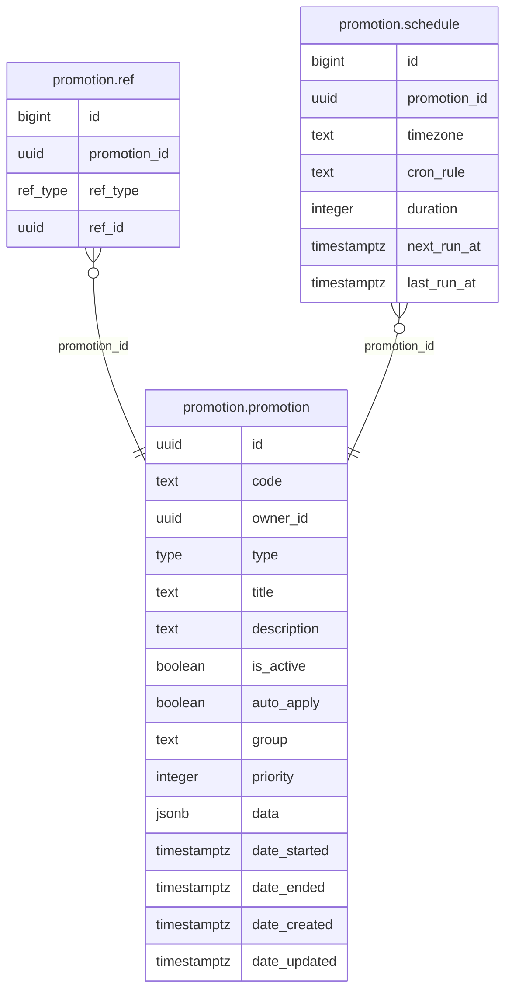

# Promotion Module

Manages promotional campaigns and computes promoted prices for the order/checkout flow. Supports multiple discount types with group-based stacking rules.

**Handler**: `PromotionHandler` | **Interface**: `PromotionBiz` | **Restate service**: `"Promotion"`

## ER Diagram

<!--START_SECTION:mermaid-->

<!--END_SECTION:mermaid-->

## Domain Concepts

### Unified Promotion Table

All promotion types share one `promotion.promotion` table. Type-specific data (min_spend, max_discount, discount_percent, discount_price) is stored as JSONB in the `data` column — avoiding a table-per-type schema.

### Promotion Types

| Type | Status | Description |
|------|--------|-------------|
| `Discount` | Implemented | Product price discount (percent or fixed amount) |
| `ShipDiscount` | Implemented | Shipping cost discount (same data structure as Discount) |
| `Bundle` | Enum only | Not yet implemented in price calculation |
| `BuyXGetY` | Enum only | Not yet implemented in price calculation |
| `Cashback` | Enum only | Not yet implemented in price calculation |

### Polymorphic Refs

The `promotion.ref` table links promotions to targets via `ref_type` + `ref_id`: `ProductSpu`, `ProductSku`, or `Category`. A promotion with no refs applies to all products.

### Group-Based Stacking

Promotions are assigned to groups. The stacking rules:

- Promotions in **different groups** stack with each other (all apply).
- Promotions in the **same group** compete — the one with the biggest total savings wins.
- A winner from the **"exclusive" group** takes all — no stacking with other groups.

This allows flexible promotion strategies: a site-wide 10% off (group "site") can stack with a category-specific free shipping (group "shipping"), but two competing category discounts in the same group won't double-apply.

### Schedule

The `promotion.schedule` table stores cron-based activation windows per promotion. The table schema exists, but the **scheduler daemon is not implemented** — promotions are currently activated/deactivated manually via `is_active` and `date_started`/`date_ended`.

## Flows

### Price Calculation (`CalculatePromotedPrices`)

Called by the order module during checkout:

1. Collect promotion codes from the buyer + fetch all `auto_apply = true` promotions.
2. Parse JSONB `data` into discount params (min_spend, max_discount, percent/price).
3. For each SKU: filter applicable promotions via ref matching (promotion refs must match the SKU's SPU, SKU ID, or category).
4. Group applicable promotions by `group` field, pick the best winner per group (highest total savings).
5. Apply winners: if any winner is in the exclusive group, only that one applies. Otherwise, stack savings across all groups.

## Implementation Notes

- **JSONB for type-specific data**: avoids the table-per-type pattern. All promotion types share one table; the `data` column holds type-specific fields. Adding a new promotion type means adding a new enum value and parsing logic — no schema migration.
- **Auto-apply promotions**: promotions with `auto_apply = true` are automatically included in price calculation without the buyer needing to enter a code. Useful for site-wide sales.
- **Owner-scoped**: each promotion has an `owner_id` (the seller who created it). Promotions only apply to products owned by the same seller.

## Endpoints

All under `/api/v1/catalog/promotion`.

| Method | Path | Description |
|--------|------|-------------|
| GET | `/:id` | Get promotion by ID with refs |
| GET | `/` | Paginated promotion list |
| POST | `/` | Create promotion (any type) |
| PATCH | `/` | Update promotion fields and refs |
| DELETE | `/:id` | Delete promotion (cascades refs) |

## Cross-Module Dependencies

| Module | Usage |
|--------|-------|
| `order` | Consumed by checkout flow via `CalculatePromotedPrices` |
| `inventory` | Promotion stock tracking (for limited-quantity promotions) |
