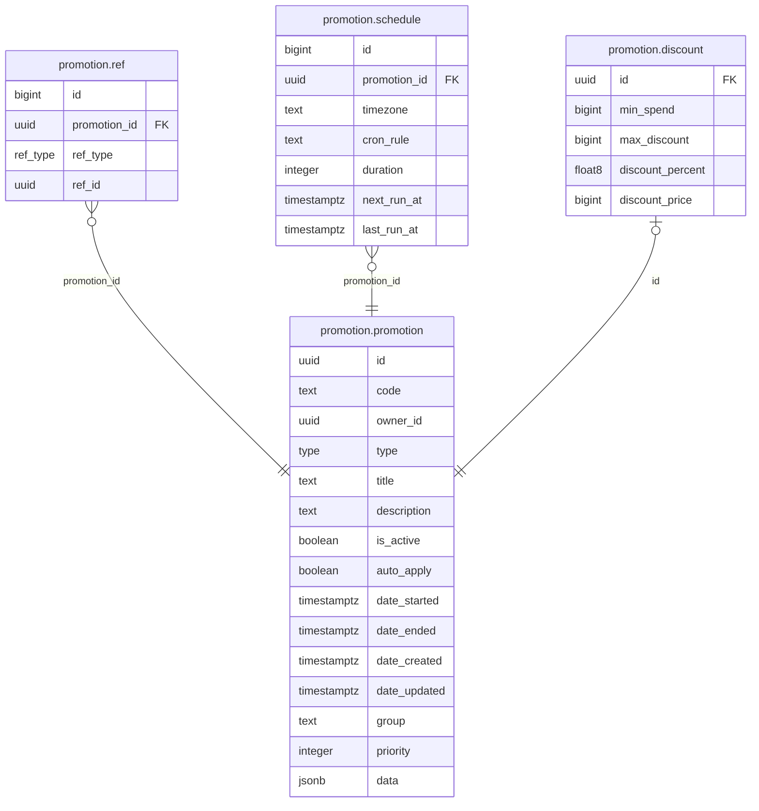

# Promotion Module

Manages promotional campaigns and computes promoted prices for the order/checkout flow.

**Struct:** `PromotionHandler` | **Interface:** `PromotionBiz` | **Restate service:** `Promotion`

## Key Concepts

- **Unified promotion table** -- all types share one `promotion.promotion` table. Type-specific data (min_spend, max_discount, discount_percent/discount_price) is stored as JSONB in the `data` column.
- **Group-based stacking** for price calculation:
  - Promotions in **different groups** stack with each other (all apply).
  - Promotions in the **same group** compete -- the one with biggest total savings wins.
  - A winner from the **"exclusive" group** means only that promotion applies (no stacking).
- **Refs** link promotions to targets: `ProductSpu`, `ProductSku`, `Category`, `Brand`. A promotion with no refs applies to everything.

## Promotion Types

| Type | Implemented | Description |
|------|-------------|-------------|
| `Discount` | Yes | Product price discount (percent or fixed amount) |
| `ShipDiscount` | Yes | Shipping cost discount (same discount data structure) |
| `Bundle` | Enum only | Not implemented in price calculation |
| `BuyXGetY` | Enum only | Not implemented in price calculation |
| `Cashback` | Enum only | Not implemented in price calculation |

## Price Calculation (`CalculatePromotedPrices`)

1. Collect promotion codes from buyer + fetch all `auto_apply` promotions
2. Parse JSONB `data` into discount params (min_spend, max_discount, percent/price)
3. For each SKU: filter applicable promotions via ref matching
4. Group applicable promotions by `group` field, pick best winner per group
5. Apply winners: exclusive group takes all, otherwise stack across groups

## Tables

`promotion.promotion` (core entity with JSONB data), `promotion.ref` (links to target entities), `promotion.schedule` (cron-based activation windows -- table exists but scheduler daemon is **not implemented**)

## API Endpoints

| Method | Path | Handler | Auth | Description |
|--------|------|---------|------|-------------|
| GET | `/api/v1/catalog/promotion/:id` | GetPromotion | No | Get promotion by ID with refs |
| GET | `/api/v1/catalog/promotion` | ListPromotion | No | Paginated promotion list |
| POST | `/api/v1/catalog/promotion` | CreatePromotion | Yes | Create promotion (any type) |
| PATCH | `/api/v1/catalog/promotion` | UpdatePromotion | Yes | Update promotion fields and refs |
| DELETE | `/api/v1/catalog/promotion/:id` | DeletePromotion | Yes | Delete promotion (cascades refs) |

## ER Diagram

