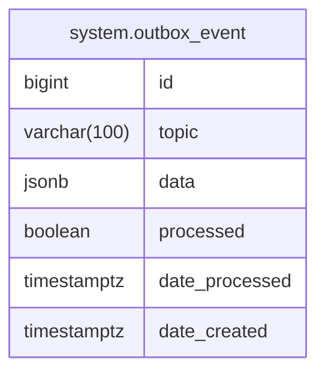

# System Module

Transactional outbox pattern for reliable event publishing.

**Struct:** `SystemHandler` (infrastructure only -- no public interface, no Restate service)

## ER Diagram

<!--START_SECTION:mermaid-->

<!--END_SECTION:mermaid-->

## How It Works

1. **Producers** (other modules) write events to `system.outbox_event` in the same DB transaction as business data -- guaranteeing consistency.
2. **Relay** reads unprocessed events and publishes them to NATS, then marks them as processed.
3. **Consumers** subscribe to NATS topics. Must be idempotent to handle at-least-once delivery.

Events are stored with `BIGSERIAL` IDs and relayed in insertion order, preserving causal ordering.

## Table

`system.outbox_event` -- columns: `id`, `topic`, `data` (JSONB), `processed`, `date_processed`, `date_created`

## No HTTP Endpoints

This module is internal infrastructure only. No routes are exposed.
