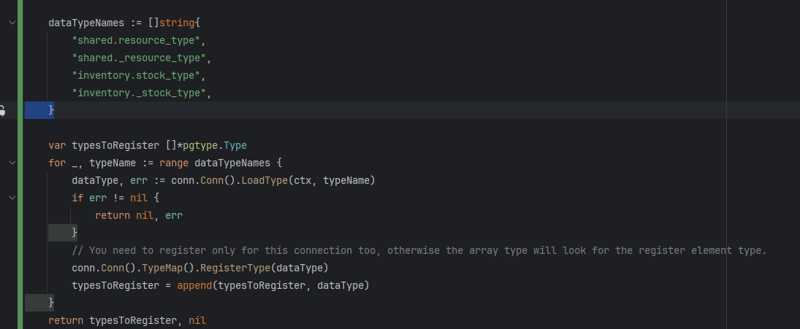
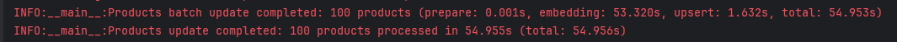
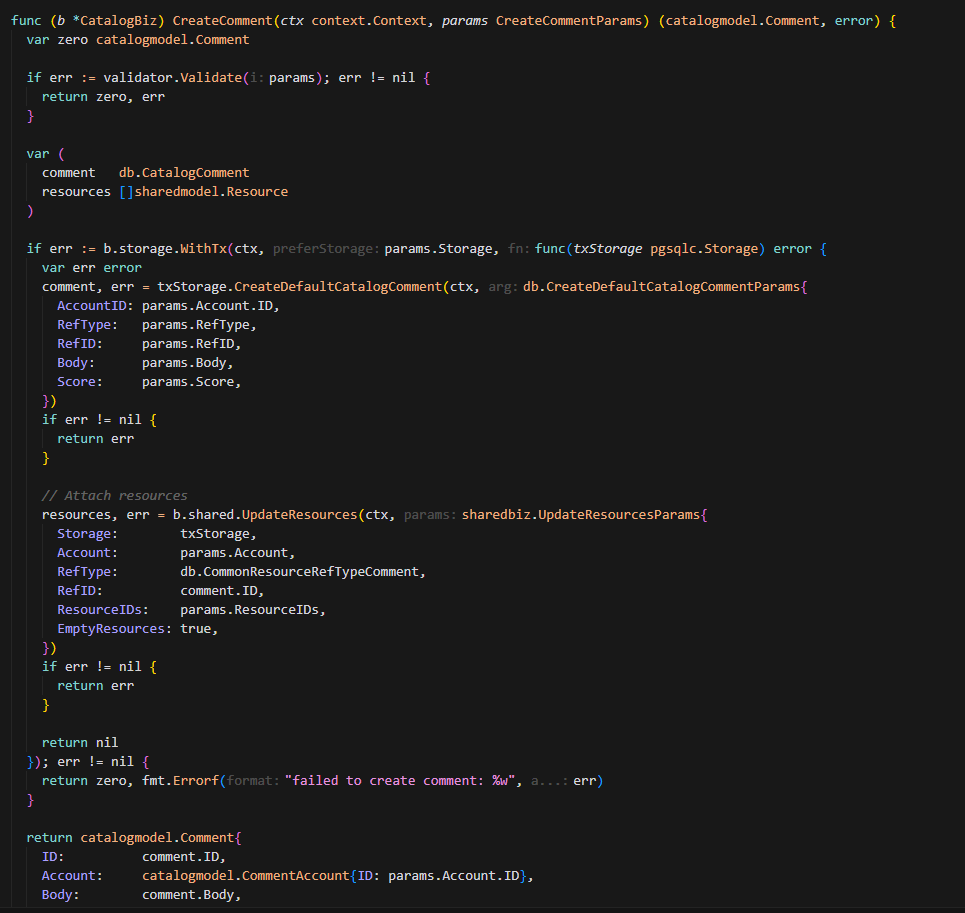
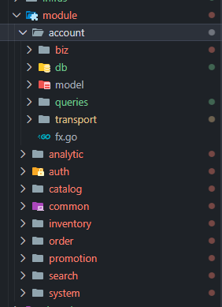

# Development Timeline

## 29-8-2025 First request only take 10ms


#### N+1 query btw but still blazingly fast


## 4-9-2025 Found a way to write better queries with sqlc.slice

I should create a PR to sqlc.dev documentation haha

```sql
SELECT *
FROM "catalog"."product_spu"
WHERE (
    ("id" = ANY (sqlc.slice('id')))
)
```

## 5-9-2025 List products with calculated sale price (from many nested queries into 6 flat queries) only take 20ms for 10 products


## 8-9-2025 Custom type need to be registered to pgx (pgxpool.go)

Any custom DB types made with CREATE TYPE need to be registered with pgx.
<https://github.com/kyleconroy/sqlc/issues/2116>


## 13-9-2025 Nice integration of enum fields between validator/v10 validation and sqlc-generated Valid() methods

With "emit_enum_valid_method: true" in sqlc.yaml and "validateFn=Valid" in struct tag
I can validate the enum field directly with the generated Valid() method from sqlc.

```go
type CreateOrderParams struct {
 Account     accountmodel.AuthenticatedAccount
 Address     string                `validate:"required"`
 OrderMethod db.OrderPaymentMethod `validate:"required,validateFn=Valid"`
 SkuIDs      []int64               `validate:"required,dive,gt=0"`
}
```

I should write a blog on this btw.

## 15-9-2025 Implement a well-structured custom Pub/Sub client for clean, maintainable publish/subscribe code

```go
// The subcriber
func (s *OrderBiz) SetupPubsub() error {
    return errutil.Some(
        s.pubsub.Subscribe("order.created", pubsub.DecodeWrap(s.OrderCreated)),
        s.pubsub.Subscribe("order.paid", pubsub.DecodeWrap(s.OrderPaid)),
    )
}

type OrderCreatedParams = struct {
    OrderID int64
}

func (s *OrderBiz) OrderCreated(ctx context.Context, params OrderCreatedParams) error {
    // code here

    return nil
}

type OrderPaidParams = struct {
    OrderID int64
    Amount  int64
}

func (s *OrderBiz) OrderPaid(ctx context.Context, params OrderPaidParams) error {
    // code here

    return nil
}

// The publisher
if err = s.pubsub.Publish("order.created", OrderCreatedParams{
    OrderID: order.ID,
}); err != nil {
    return zero, err
}
```

With this approach, I can easily add new event handlers by simply defining a new struct for the event parameters and implementing the corresponding handler method.
Also when finding subcribers, I can search globally by "OrderCreated*" or "OrderPaid*" to find all related handlers because the handler name is the same as the event name.

## 25-9-2025 First demo of recommendation engine with milvus vector search

**No more elasticsearch:**

- Elasticsearch is great, but vector databases are the future.
- After certain days with elasticsearch, found it is not suitable for vector search.
- As I remember, I was using model MGTE (alibaba) storing 200rows took 8mb of storage

- Inserting into milvus took 60seconds per 100 products


## 7-10-2025 Refactor payment and shipment with better interface

- Maintainer will now easier to add new payment gateway or shipment provider

```go
func (s *OrderBiz) SetupPaymentMap() error {
 var configs []sharedmodel.OptionConfig

 s.paymentMap = make(map[string]payment.Client) // map[gatewayID]payment.Client

 // setup cod client
 codClient := cod.NewClient()
 s.paymentMap[codClient.Config().ID] = codClient
 configs = append(configs, codClient.Config())

 // setup vnpay client
 vnpayClients := vnpay.NewClients(vnpay.ClientOptions{
  TmnCode:    config.GetConfig().App.Vnpay.TmnCode,
  HashSecret: config.GetConfig().App.Vnpay.HashSecret,
  ReturnURL:  config.GetConfig().App.Vnpay.ReturnURL,
 })
 for _, c := range vnpayClients {
  s.paymentMap[c.Config().ID] = c
  configs = append(configs, c.Config())
 }

 if err := s.shared.UpdateServiceOptions(context.Background(), "payment", configs); err != nil {
  return err
 }

 return nil
}
```

- Create shared service option table to store the payment and shipment options

```sql
CREATE TABLE "shared"."service_option" (
    "id" VARCHAR(100) NOT NULL,
    "category" TEXT NOT NULL,
    "name" TEXT NOT NULL,
    "description" TEXT NOT NULL,
    "provider" TEXT NOT NULL,
    "method" TEXT NOT NULL,
    "is_active" BOOLEAN NOT NULL DEFAULT true,

    CONSTRAINT "service_option_pkey" PRIMARY KEY ("id")
);
```

## 30-10-2025 After a long time of lazying around

## 7-11-2025 Refactor database wrapper (storage)

Add transaction callback to storage interface to reduce boilerplate code when using transaction. Back then I always forget to commit/rollback the transaction

```go
// WithTx executes the given function within a transaction, prefer using the provided Storage if not nil, automatically commit/rollback
 WithTx(ctx context.Context, preferStorage Storage, fn func(txStorage Storage) error) error
```

- With this approach, you can pass the preferStorage from outer biz layer to inner biz layer when both layers need to use transaction. Eg: CreateComment which calls UpdateResources atomically.
- You can choose to have a nested transaction by setting allowNestedTx (default: false) to true in NewTxQueries.



## 8-11-2025 Use errors.Join instead of my own errutil.Some

```go
func Some(errs ...error) error {
 for _, err := range errs {
  if err != nil {
   return err
  }
 }
 return nil
}

// Standard library approach (Go 1.20+)
err := errors.Join(err1, err2, err3)
// Returns an error containing all non-nil errors

// Your Some function
err := errutil.Some(err1, err2, err3)
// Returns only the first non-nil error
```

## 18-11-2025 Making big update for entire project

- Each service has its own storage interface (db) to reduce coupling between services
- Refactor pgsqlc module to support generic
- Refactor entire order schema to support both multi-vendor and single-vendor ecommerce systems
- Now support register all custom types for encode plans in pgxpool instead of hardcoded type names (internal/infras/pg/pg.go)
- Remove the global config.GetConfig() calls, pass the config struct to each service biz layer instead for better testability and reduce coupling


